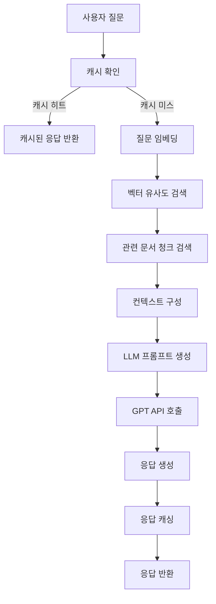

# RAG QA System - 시스템 아키텍처 및 기술 스택

## 📋 시스템 개요

BC Card의 문서 기반 질의응답 시스템으로, LangChain과 벡터 데이터베이스를 활용하여 사용자의 질문에 대해 관련 문서를 검색하고 AI 모델을 통해 답변을 생성합니다.

## 🏗️ 시스템 아키텍처

```
┌─────────────────┐    ┌──────────────────┐    ┌─────────────────┐
│   Frontend      │    │   Backend        │    │   Vector DB     │
│   (Web UI)      │◄──►│   (Flask API)    │◄──►│   (ChromaDB)    │
└─────────────────┘    └──────────────────┘    └─────────────────┘
                                │
                                ▼
                       ┌──────────────────┐
                       │   Cache Layer    │
                       │ (Redis + SQLite) │
                       └──────────────────┘
                                │
                                ▼
                       ┌──────────────────┐
                       │   LLM Service    │
                       │   (OpenAI API)   │
                       └──────────────────┘
```

## 🛠️ 기술 스택

### 웹 프레임워크
- **Flask**: Python 웹 프레임워크
- **Flask-RESTX**: RESTful API 개발 및 Swagger 문서화
- **Flask-CORS**: Cross-Origin Resource Sharing 지원

### 프론트엔드
- **HTML5 + CSS3**: 기본 마크업 및 스타일링
- **JavaScript (ES6+)**: 클라이언트 사이드 로직
- **Bootstrap 5**: UI 컴포넌트 라이브러리
- **Font Awesome**: 아이콘 라이브러리

### AI/ML 프레임워크
- **LangChain**: LLM 애플리케이션 개발 프레임워크
- **OpenAI GPT**: 언어 모델 서비스
  - `gpt-4o-mini`: 고속 처리용 (기본)
  - `gpt-4-turbo`: 정밀도 중심 처리용

### 임베딩 모델
- **OpenAI text-embedding-3-small**: 
  - 차원: 1,536
  - 용도: 문서 및 쿼리 벡터화
  - 비용 효율적이면서 높은 성능

### 벡터 데이터베이스
- **ChromaDB**: 
  - 오픈소스 벡터 데이터베이스
  - 임베딩 벡터 저장 및 유사도 검색
  - 메타데이터 필터링 지원
  - SQLite 기반 로컬 저장

### 캐싱 시스템
- **하이브리드 캐시 구조**:
  - **Redis**: 빠른 메모리 기반 캐시
  - **SQLite**: 영구 저장용 캐시
  - **인기 질문 캐시**: 자주 묻는 질문 별도 관리

### 문서 처리
- **Python-docx**: DOCX 파일 처리
- **PyPDF2**: PDF 파일 처리
- **Unstructured**: 다양한 문서 형식 지원

## 📄 청킹 전략 (Chunking Strategy)

### 현재 설정
```python
DEFAULT_CHUNK_SIZE = 1000      # 청크 크기 (토큰 수)
DEFAULT_CHUNK_OVERLAP = 200    # 청크 간 겹침 (토큰 수)
DEFAULT_SEPARATOR = "\n\n"     # 문단 기준 분할
```

### 청킹 전략 종류

#### 1. **고정 크기 청킹 (Fixed-size Chunking)** ⭐ *현재 사용*
```python
# 장점
- 구현이 간단하고 예측 가능
- 메모리 사용량이 일정
- 처리 속도가 빠름

# 단점
- 문맥이 중간에 끊어질 수 있음
- 문서 구조를 고려하지 않음

# 적용 상황
- 일반적인 텍스트 문서
- 균일한 구조의 문서
```

#### 2. **의미적 청킹 (Semantic Chunking)**
```python
# 장점
- 문맥을 보존
- 더 나은 검색 품질
- 의미 단위로 분할

# 단점
- 계산 비용이 높음
- 청크 크기가 불균일
- 구현 복잡도 증가

# 적용 상황
- 전문 문서
- 복잡한 구조의 문서
```

#### 3. **문서 구조 기반 청킹 (Structure-aware Chunking)**
```python
# 장점
- 문서의 논리적 구조 유지
- 제목, 섹션별 분할 가능
- 메타데이터 활용 가능

# 단점
- 문서 형식에 의존적
- 구조가 없는 문서에 부적합
- 파싱 복잡도 증가

# 적용 상황
- 구조화된 문서 (PDF, HTML)
- 법률 문서, 매뉴얼
```

### 청킹 최적화 가이드

#### 📏 **청크 크기 설정**
```
작은 청크 (500-800 토큰):
✅ 정확한 검색
✅ 빠른 처리
❌ 문맥 손실 가능성

중간 청크 (800-1200 토큰): ⭐ 권장
✅ 문맥과 정확도 균형
✅ 대부분 상황에 적합

큰 청크 (1200-2000 토큰):
✅ 풍부한 문맥
❌ 검색 정확도 저하
❌ 처리 시간 증가
```

#### 🔄 **겹침(Overlap) 설정**
```
작은 겹침 (10-15%):
- 빠른 처리
- 저장 공간 절약
- 문맥 연결성 낮음

중간 겹침 (15-25%): ⭐ 권장 (현재 20%)
- 적절한 문맥 보존
- 성능과 품질 균형

큰 겹침 (25-40%):
- 높은 문맥 연결성
- 저장 공간 증가
- 중복 정보 많음
```

## 🔍 검색 및 응답 생성 플로우



## 📊 성능 최적화

### 캐시 전략
- **L1 캐시**: Redis (빠른 접근)
- **L2 캐시**: SQLite (영구 저장)
- **인기 질문**: 별도 테이블 관리
- **TTL**: 24시간 (설정 가능)

### 검색 최적화
- **하이브리드 검색**: 벡터 + 키워드 검색
- **Re-ranking**: 검색 결과 재순위화
- **필터링**: 메타데이터 기반 사전 필터링

## 🔧 설정 및 환경변수

### 주요 설정 파일
```
config.py              # 기본 설정
data/config/admin_settings.json  # 관리자 설정
requirements.txt       # Python 의존성
```

### 환경변수
```bash
OPENAI_API_KEY=        # OpenAI API 키
FLASK_ENV=development  # 개발/운영 환경
CACHE_TYPE=sqlite      # 캐시 타입
REDIS_URL=             # Redis 연결 URL (선택)
```

## 🚀 배포 및 스케일링

### 현재 구조 (단일 서버)
```
├── Flask 웹서버
├── ChromaDB (로컬)
├── SQLite 캐시
└── Redis (선택)
```

### 확장 가능 구조
```
┌─────────────┐    ┌─────────────┐    ┌─────────────┐
│ Load        │    │ App Server  │    │ Vector DB   │
│ Balancer    │◄──►│ (Multiple)  │◄──►│ (Distributed)│
└─────────────┘    └─────────────┘    └─────────────┘
                           │
                           ▼
                   ┌─────────────┐
                   │ Redis       │
                   │ Cluster     │
                   └─────────────┘
```

## 📈 모니터링 및 로깅

### 추적 메트릭
- 응답 시간
- 캐시 히트율
- 벡터 검색 정확도
- API 호출 횟수
- 에러율

### 로그 레벨
```python
DEBUG: 상세 디버깅 정보
INFO:  일반적인 정보
WARN:  경고 메시지
ERROR: 오류 정보
```

## 🔒 보안 고려사항

### 인증 및 권한
- 관리자 패스워드 보호
- JWT 토큰 기반 세션
- API 엔드포인트 보호

### 데이터 보안
- 민감 정보 마스킹
- 로그 데이터 암호화
- 접근 권한 제어

---

*최종 업데이트: 2025-08-13*
*작성자: Claude AI Assistant*