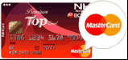
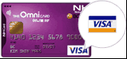
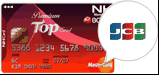
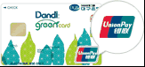
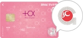
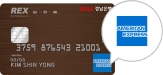
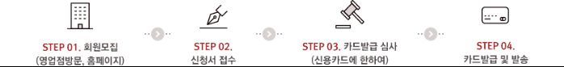

# 회원은행별 카드발급안내

## 📋 개요
BC카드는 다양한 은행과 제휴하여 각 은행별 특색있는 카드상품을 제공하고 있습니다.
각 회원은행별로 발급 가능한 카드와 혜택을 확인해보세요.

## 🏦 주요 제휴 은행 및 카드

### 1. 우리카드 (Woori Card)

- **주요 특징**: 우리은행과의 시너지 효과
- **대표 상품**: 우리 BC카드, 우리 멀티카드
- **혜택**: 우리은행 우대 서비스, 포인트 적립
- **발급 기준**: 우리은행 거래 고객 우대

### 2. 하나카드 (Hana Card)  

- **주요 특징**: 하나금융그룹 통합 서비스
- **대표 상품**: 하나 BC카드, 하나 올쇼핑카드
- **혜택**: 하나은행 수수료 면제, 적립금 혜택
- **발급 기준**: 하나은행 주거래 고객 우선

### 3. 농협카드 (NH Card)

- **주요 특징**: 농협금고와의 연계 서비스
- **대표 상품**: NH BC카드, 농협 체크카드
- **혜택**: 농협 수수료 우대, 농산물 할인
- **발급 기준**: 농협 조합원 우대 조건

### 4. BC카드 (BC Card)

- **주요 특징**: BC카드 직접 발급
- **대표 상품**: BC Top카드, BC 바로카드
- **혜택**: 다양한 가맹점 할인, 포인트 적립
- **발급 기준**: 일반 신용평가 기준 적용

### 5. 신한카드 (Shinhan Card)

- **주요 특징**: 신한은행과의 제휴 서비스
- **대표 상품**: 신한 BC카드, 신한 올라운드카드
- **혜택**: 신한은행 우대 금리, 포인트 통합 관리
- **발급 기준**: 신한은행 고객 우대

### 6. 국민카드 (KB Card)

- **주요 특징**: 국민은행과의 종합 금융 서비스
- **대표 상품**: KB BC카드, KB 국민카드
- **혜택**: 국민은행 거래 우대, 리브메이트 적립
- **발급 기준**: KB국민은행 고객 우선 심사

### 7. 롯데카드 (Lotte Card)

- **주요 특징**: 롯데그룹 계열사 할인 혜택
- **대표 상품**: 롯데 BC카드, 롯데 멤버스카드
- **혜택**: 롯데백화점, 롯데마트 할인
- **발급 기준**: 일반 발급 기준 적용

### 8. 삼성카드 (Samsung Card)

- **주요 특징**: 삼성그룹과의 제휴 혜택
- **대표 상품**: 삼성 BC카드, 삼성 테크카드
- **혜택**: 삼성전자 제품 할인, 포인트 적립
- **발급 기준**: 일반 신용도 평가

### 9. 현대카드 (Hyundai Card)

- **주요 특징**: 현대자동차그룹과의 시너지
- **대표 상품**: 현대 BC카드, 현대 오토카드
- **혜택**: 자동차 관련 서비스, 주유 할인
- **발급 기준**: 일반 심사 기준

### 10. 씨티카드 (Citi Card)

- **주요 특징**: 글로벌 금융 서비스
- **대표 상품**: 씨티 BC카드, 씨티 프리미어카드
- **혜택**: 해외 이용 우대, 공항 라운지 서비스
- **발급 기준**: 높은 신용도 요구

## 📋 카드 발급 절차

### 1. 신청 준비
- 신분증 (주민등록증, 운전면허증, 여권)
- 소득 증명서류 (재직증명서, 급여명세서)
- 거주지 확인 서류

### 2. 발급 신청

- 온라인 또는 영업점 방문
- 신청서 작성 및 서류 제출
- 본인 확인 절차

### 3. 심사 과정
- 신용도 평가
- 소득 및 재산 확인
- 기존 카드 이용 이력 검토

### 4. 카드 발급
- 심사 승인 시 카드 제작
- 등기우편 발송 (7-10일 소요)
- SMS/이메일 발송 안내

## 💡 발급 팁

### ✅ 승인률 높이는 방법
1. **신용등급 관리**: 6등급 이상 유지
2. **소득 증빙**: 정확한 소득 서류 준비
3. **기존 카드 관리**: 연체 없이 성실 이용
4. **은행 거래 이력**: 주거래 은행 우선 선택

### ❌ 거절 요인
1. 신용등급 7등급 이하
2. 최근 6개월 내 연체 이력
3. 과도한 카드 보유 (5장 이상)
4. 소득 대비 과다 부채

## 📞 문의처
- BC카드 고객센터: 1588-4000
- 각 은행별 고객센터
- BC카드 공식 홈페이지: www.bccard.com

---
*본 정보는 2024년 기준이며, 카드사 정책에 따라 변경될 수 있습니다.*