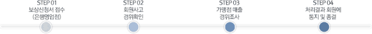
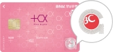
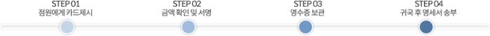
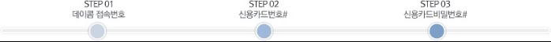
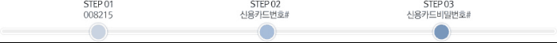
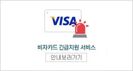
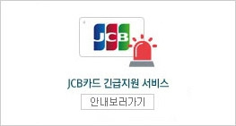
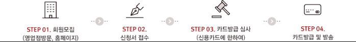

**/[카드이용안내**](https://www.bccard.com/app/card/ContentsLinkActn.do?pgm_id=ind0667)**

[**\[카드생활 TIP](https://www.bccard.com/app/card/ContentsLinkActn.do?pgm_id=ind1098)**]**

**1.  금융소비자 권익보호 안내**

\1) 신용카드 가입시 주요 내용을 설명듣고 약관·핵심 설명서를 받을 권리가 있습니다\.

- 약관 주요내용을 설명듣고, 신용카드와 함께 약관·핵심 설명서를 받을 수 있습니다.

\2) 신용카드 중도 해지시 잔여기간 연회비를 돌려받을 권리가 있습니다\.

- 연회비 부과기간 종료 전에 카드를 중도해지하는 경우 잔여기간의 연회비를 돌려 받을 수 있습니다.
  (다만, 신용카드 표준약관상 신규카드 발급·부가서비스 제공에 이미 지출된 비용은 차감후 반환됨)

\3) 신용카드를 1년 이상 사용하지 않은 경우 자동으로 해지될 수 있습니다\.

- 1년 이상 신용카드 미사용시, 서면, 전화, 전자문서 등의 방법으로 계약 해지·유지 여부를 알려드리며
  계속 사용의사를 밝히지 않은 경우, 미사용 1년 도래시점부터 3개월내 자동 해지됩니다.

\4) 신용카드 출시 후 3년 이내에는 부가서비스를 축소·폐지할 수 없습니다\.

- 카드사는 카드 신규 출시 후 3년 이내에 부가서비스를 축소·폐지할 수 없으며 (단, 법령에서 정한 경우 제외),
  부득이 부가서비스 변경이 필요한 경우, 6개월 전부터 알려드립니다.

\5) 신용카드등의 정보유출 등으로 인한 부정사용은 카드사가 책임집니다\.

- 정보유출 및 카드 위변조, 해킹, 전산장애, 내부자정보유출등 부정한 방법으로 사용된 금액은 카드사가 책임집니다.
  (다만, 금융소비자의 고의·중대한 과실 시 전부 또는 일부 책임 부담)

\6) 신용카드 수령시 뒷면에 반드시 서명해야 하고, 타인에게 카드를 양도\.양수\.대여를 해서는 안됩니다\.

- 금융소비자는 카드 뒷면에 서명을 하지 않고, 잃어버리거나 타인에게 카드를 빌려주어
  부정사용이 발생된 경우 부정사용금액에 대해 책임을 질 수 있습니다.

\7) 신용카드 분실·도난 시 즉시 카드사에 신고해야 합니다\.

- 카드사는 분실.도난등의 통지가 접수된 날로부터 60일전까지 발생한 부정사용금액에 대해서 책임집니다.
  (다만, 소비자의 고의·과실 시 전부 또는 일부 책임 부담)

※ 자세한 세부내용은 카드 상품별로 상이할 수 있으니, 신용카드설명서, 금융상품약관 등을 꼭 확인하시기 바랍니다.

/

**/2. 신용카드 이용/관리 안내**

\1) 수령 후 서명

- 카드를 분실하더라도 타인의 부정사용을 방지하고 부정사용 내역에 대해 보상받을 수 있습니다.
- 신용카드를 발급받으면 가장 먼저 해야 할 일은 신용카드 뒷면에 자필로 서명하는 일입니다.
  만일, 서명 없이 카드를 분실해 부정사용이 발생하면 보상받을 수 없습니다.
  이는 부정사용자가 임의로 서명하여 이용한다면 가맹점에서 회원 본인이 정당하게 이용하는지 여부를 확인할 수 없기 때문입니다.

\2) 양도 금지

- 부정사용자로 오인 받을 수 있으며, 분실 시에 보상이 어려워질 수 있습니다.
- 여신전문금융업법과 개인회원약관에서 카드를 양도, 양수하거나 질권을 설정 할 수 없다고 규정하고 있으며,
  가족이 함께 이용하려면 가족카드를 추가 발급하여 이용해야 합니다.

\3) 안전한 카드 이용

- 승인내역 및 주요정보를 통지 받음으로써 더욱 안전하게 카드를 이용할 수 있으며,
  분실 도난으로부터 부정사용을 즉시 인지하고 신고할 수 있어 더 큰 피해를 사전에 예방할 수 있습니다.
- 카드이용내역 알림서비스는 [바로알림서비스](https://www.bccard.com/app/card/ContentsLinkActn.do?pgm_id=ind0447 "페이지 이동") 메뉴에서 신청하실 수 있습니다.

\4) 정보 및 변경사항 관심 및 활용

- 고객님의 개인정보가 변경된 경우 [회원정보변경](https://www.bccard.com/app/card/MemberActn.do "페이지 이동") 메뉴에서 정보를 변경해 주세요.
- 변경내용을 신고함으로써 이전 주소지로 명세서가 발송되어 개인신용정보 유출 가능성을 차단하고, 중요한 정보를 놓치지 않고 받을 수 있으며,
  항상 안전하게 카드를 이용할 수 있습니다.

\5) 정보의 타인제공 금지

- 비밀번호 및 기타번호 제공을 금지하며, 타인에게 제공 시 위변조 등의 피해가 발생할 수 있습니다.
- 비밀번호는 개인 신상과 관련 숫자를 설정하지 마시고 은행 거래 시 비밀번호가 유출되지 않도록 유의해 주세요.

\6) 카드분실 및 부정사용 발생시 즉시 신고

- 카드분실 및 부정사용이 발생한 경우 즉시 신고해 주시면 피해를 최소화할 수 있습니다.
- 카드사는 가맹점 매출 내역, 가맹점 준수 사항 및 회원의 고의성 여부를 확인하고, 중대한 과실이 없는 경우 보상할 수 있습니다.

\7) 불법 할인 등 금지

- 불법거래 행위로 확인 시 회원은 금융거래 제한을 받고 개인 신상정보 유출로 각종 범죄에 악용되어 더 큰 피해가 발생할 수 있습니다.
  혹시 발생하였을 경우 피해를 최소화하기 위하여 고객센터로 연락해 주시기 바랍니다.

\8) 해외 거래와 국내 단기카드대출 안심거래 등록

- 국내단기카드대출과 해외이용거래를 이용하지 않을 때에는 [SAFE BC](https://www.bccard.com/app/card/ContentsLinkActn.do?pgm_id=ind0455 "페이지 이동") 메뉴에서 이용제한을 등록·해제함으로써
  위/변조 및 부정사용을 사전에 차단할 수 있습니다.

\9) 과도한 영업행위 등 주의

- 콘도 회원권 당첨, 100% 환불 등 이벤트가 있는 경우, 피해 예방을 위해 정확하게 확인 후에 거래를 하시기 바랍니다.
- 전화, 인터넷 등 거래시 업체의 경품 당첨 등의 유혹에 넘어가 본인의 카드정보를 알려주는 일이 없도록 하여야 합니다.

\10) 회원제 업소 등의 경우 신용카드 할부 이용

- 회원제 업소 등의 경우 신용카드 할부 이용은 할부거래법 등에 의해 카드사가 보호하고 있어 할부거래가 일시불 보다 안전합니다.
  단, 거래시 할부 계약의 취소 및 환불가능 여부 등을 확인하고 계약관계 서류를 보관하여야 합니다./

**/. 신용카드 TIP**

**1) [신용카드알뜰이용법**](https://www.bccard.com/app/card/ContentsLinkActn.do?pgm_id=ind0667)**

**1-1) 일시불 구매**

큰액수는 결제 시에 가급적 일시불로 이용하여 주시기 바랍니다.

- 전자제품 등 고가품의 상품을 구입할 때는 현금보다는 신용카드를 이용하여 일시불로 구입해야 합니다.
- 일시불은 별도의 수수료 부담 없이 물품구매일로부터 최단 13일에서 최장 44일까지 현금결제를 유예해주기 때문입니다.
  물품구매에 이용하려던 현금을 통장에 그대로 넣어두면 되기 때문에, 은행에서 지급하는 이자도 받을 수 있는 이점이 있습니다.

**1-2) 할부구매**

할부구매를 이용하실 경우 할부 개월수를 합리적으로 선/택하실 수 있습니다.

- 통상 할부구매의 경우 금액이 높은 고가품이 많기 때문에 일정 정도의 구매계획을 가지고 구입하는 것이 좋습니다.
  따라서 급한 경우가 아니라면 할부구매의 이용시점에 더욱 주의를 기울여야 합니다.
- 할부구매를 이용하실 경우 각 구간별 마지막 개월수로 이용하는 것이 훨씬 유리합니다.

※ 총 할부수수료 산출식= [할부원금 X 수수료율 X (할부개월수+1)/2〕÷ 12

- BC바로카드 할부기간별 할부 수수료율

■ 할부수수료율 : 4.9% ~ 19.9%

※ 할부 수수료 : 할부잔액 X 할부 수수료율 X 사용일수 ÷ 365
(할부잔액 : 할부이용금액 – 기 납부한 할부원금)

※ 할부 수수료율을 체크해주시기 바랍니다.
매월 카드사에서 발송되는 이용대금 청구서에는 할부수수료율이 자세히 표기되어 있습니다.

할부구매 후 자금의 여유가 생겼을 경우에는 할부 선결제 제도를 활용하시기 바랍니다.

- 선결제란 할부기간이 종료되기 전에 할부이용 건 별로 할부잔액 전부를 일시불로 결제할 수 있는 서비스입니다. 단기카드대출과 마찬가지로
  할부구매의 경우에도 선결제제도(중도상환제도)를 이용하여 불필요한 할부수수료 부담을 줄일 수 있습니다.

**1-3) 단기카드대출(현금서비스)**

단기카드대출(현금서비스)은 회원의 신용카드 이용실적과 신용도에 따라, 손쉽게 이용이 가능한 대출 서비스입니다.

- 대출 관련 서류없이 카드사가 사전에 총 한도 내 단기카드대출(현금서비스)한도를 부여하였으며, 언제든지 이용할 수 있습니다. 이용하는 방법은 은행 자동화기기(ATM), ARS, 인터넷, APP 등 신청 이용이 가능합니다.

단기카드대출 이용 후 자금의 여유가 생겼을 경우에는 선결제 제도를 통해 불필요한 수수료 부담을 줄이시기 바랍니다.

- 신용카드사는 회사채를 발행하여 자금을 조달하기 때문에 단기카드대출 수수료율이 일반은행의 대출금리에 비해 높습니다. 따라서 긴급한 상황에서 단기카드대출을 받으신 후에 자금에 여유가 생겼을 때는 해당 카드사 고객센터 및 APP등 채널을 통하여 선결제 서비스를 이용하여 대출금액을 미리 상환하시기 바랍니다
- 선결제를 이용하시면 단기카드대출 금액을 상환한 날짜까지만 이용기간으로 계산되기 때문에 불필요한 수수료 부담을 줄일 수 있습니다.

단기카드대출 수수료율을 체크해주시기 바랍니다.

- 매월 카드사에서 발송되는 이용대금 청구서에는 단기카드대출 이용 일자별 수수료율이 자세히 표기되어 있습니다.
- 최근 금리가 자주 변동되는 시기이기 때문에 단기카드대출 수수료, 할부수수료, 연체료 등의 각종 요율 또한 자주 변동 될 수 있습니다.
- 2개 이상의 카드를 소지한 회원의 경우에는 반드시 이용대금 청구서에 표기된 수수료율의 상호비교를 통해 낮은 수수료를 적용하는 카드를
  이용하는 것이 현명합니다.

|단기카드대출 이용방법|별도수수료|
| :- | :- |
|단기카드대출 자동지급기(CD기) 은행직접방문|별도수수료 없음|
|인터넷 단기카드대출 안전결제(ISP)서비스 가능 PC에서 이용|별도수수료 없음|
|ARS서비스|별도수수료 없음|
|24시간 단기카드대출|별도수수료 추가 발생|

단기카드대출을 이용한 후에는 매출전표를 반드시 보관하여야 합니다.

- 통상 단기카드대출은 단기카드대출 자동지급기(CD기)를 통해 이용하는 경우가 많기 때문에 만일 문제가 발생하였을 경우에는
  단기카드대출 이용사실을 증명할 수 있는 유일한 자료가 바로 매출전표입니다.

**1-4) 일부결제금액 이월약정(리볼빙)**

결제성리볼빙은 당월 일시불거래 청구금액 중 회원이 카드사와 약정한 약정(최소)결제비율 이상을 납부하면 다음 달 결제일에 잔여결제금액과 리볼빙 수수료를 합산하여 납부하는 결제방식입니다.

<table><tr><th>대상거래</th><th>국내·해외 일시불 이용금액만 가능 (단기카드대출(현금서비스), 할부 등 일부거래 제외)</th></tr>
<tr><td>약정기간</td><td>이용 시점부터 해당 카드의 유효기간(최장 5년)까지 1년 단위로 회원이 선택합니다.</td></tr>
<tr><td rowspan="2">약정결제비율</td><td>10 ~ 100% 사이에서 회원이 선택</td></tr>
<tr><td>회원이 결제일에 결제를 원하는 비율로, 최소결제비율 이상으로 선택가능</td></tr>
<tr><td>최소결제비율</td><td>
10 ~ 30% 내에서 카드사가 정함

회원이 결제일에 결제해야 할 최소결제금액을 산정하는 비율
</td></tr>
<tr><td>최소결제금액</td><td>최소결제비율에 의거하여 최소결제금액이 산정되며, 최소결제금액 이상 결제 시 연체되지 않으며, 잔여 원금은 다음 달로 이월(이월금액에 대해서는 약정 수수료율에 따라 수수료 부과)됩니다.</td></tr>
<tr><td>수수료율</td><td>
회원 본인의 신용도 및 기여도에 따라 차등 적용되며, 회원 본인의 수수료율은 페이북에서 서비스 신청 시 확인 가능합니다.

기존 이용고객의 수수료율은 이용대금명세서를 통하여 수수료율 확인이 가능합니다.
</td></tr>
<tr><td>결제안내</td><td>신용카드 이용대금 명세서를 통해 안내</td></tr>
<tr><td>신청경로</td><td>페이북APP > 전체 > 대출 > 일부결제금액이월약정(리볼빙)</td></tr>
</table>

**1-5) 장기카드대출(카드론)이란?**

BC바로카드 우량 회원이 서류없이 언제든 간편하게 신청할 수 있고 중도상환수수료 및 취급수수료가 없는 대출성 상품입니다.

|이용대상|BC바로카드 우량 고객|
| :- | :- |
|이용한도|최대 5000만원|
|약정기간|대출 약정시에 최대 60개월 이내에서 회원이 선택|
|상환방법|원리금 균등분할상환, 원금 균등분할상환|
|수수료율|회원 본인의 신용도 및 기여도에 따라 차등 적용되며 본인의 수수료율은 페이북에서 조회 시 확인가능함|
|취급수수료|없음|
|연체이자율|약정 이자율+최고3%(법정 최고금리 이내)|
|필요서류|없음|
|신청경로|페이북APP > 전체 > 대출 > 장기카드대출(카드론)|

※ 상환능력에 비해 대출금이 과도할 경우 귀하의 개인신용평점이 하락할 수 있습니다.
※ 일정기간 원리금을 연체할 경우 모든 원리금을 변제할 의무가 발생할 수 있습니다.

**1-6) 포인트적립**

일시불/ 할부구매 시에는 고객님께 각종 포인트 서비스가 제공됩니다.

- 일시불과 할부이용 시에는 단기카드대출 이용과 달리 사용하시는 카드상품 혜택 또는 제휴 가맹점에 따라 각종 포인트 서비스가 제공됩니다.
- 따라서 자신의 생활패턴에 맞는 신용카드를 이용하면 각종 포인트 혜택에 따른 할인 및 사은품 증정 등의 부가서비스를 받을 수 있습니다.
- 자가용으로 출퇴근을 하는 사람이라면 오일카드를, 해외출장이 잦은 사람이라면 항공카드를, 휴대폰을 자주 이용하는 사람이라면
  모바일 카드를 이용하는 것이 다른 카드를 이용하는 것에 비해 훨씬 유리합니다.
- 뿐만 아니라 각 제휴업체의 다양한 부가서비스를 추가로 받을 수도 있으며 추가 할인혜택을 받을 수도 있습니다.

**1-8) 기타**

신용카드의 이용실적은 곧 바로 고객님의 신용평가에 반영됩니다.

- 이용대금을 연체하시거나 불필요한 신용카드 발급은 신용등급 혹은 개인신용평점이나, 카드 이용한도 등에 영향을 미칠 수 있으므로, 반드시 필요한 카드만 발급받아 이용하여 주시기 바랍니다.

이용대금청구서와 함께 발송되는 안내자료를 활용하시면 도움이 됩니다.

- 매월 이용대금청구서의 안내자료에는 여러가지 수수료와 함께 포인트, 이용혜택 등 유의사항 안내하여 드리고 있습니다. 필히 한번씩 읽어 주시기 바랍니다.

신용카드 이용약관을 반드시 읽어보시기 바랍니다.

- 회원약관은 평상시 카드를 잘 이용하고 있는 경우에는 별로 중요시되지 않습니다. 하지만, 카드를 분실, 도난 당하거나 고객님께서 구매하신
  상품에 하자가 발생하였을 때에는 보상처리의 중요한 기준이 됩니다. 회원약관을 반드시 한 번 이상 읽어보셔서 뜻하지 않은 상황이 발생할 경우
  생기는 손실을 사전에 예방해 주시기 바랍니다.

신용카드 관련 금융거래 시 개인신용평점에 영향을 미칠 수 있습니다.

- 평균적으로 연체율이 높은 신용공여는 일반적인 공여 및 은행 등 다른 금융권역의 신용공여보다 신용점수가 더 큰 폭으로 하락할 수 있습니다.

**2) 신용카드소득공제**

**2-1) 신용카드 소득공제란?**

- 근로소득자 연말정산 시 1월 1일 ~ 12월 31일까지 신용카드 이용금액의 일정금액을 근로소득금액에서 공제받는 것을 말합니다.

|공제가능 신용카드|국내에서 발행된 신용카드, 직불카드(체크/플러스카드 포함), 기명식 선불카드|
| :- | :- |
|공제대상|
\*근로소득자 본인의 신용,체크카드, 기명식/기명화된 선불카드의 사용금액 합계

\*기본공제 대상 중 연간 소득금액이 100만원 이하인 배우자, 직계존비속의 사용금액

\*가족카드의 신용카드 등 사용금액 확인서는 본인회원과 별도 발송
|

**2-2) 소득공제를 위한 이용금액 확인서 발송**

- 고객님의 소득공제용 BC카드 이용금액 확인서는 요청하는 회원에 한해 1월 중순 경부터 우편 또는 e-mail로 발송할 예정입니다.
- BC카드 이용금액 확인서는 고객님의 모든 BC카드(우리카드, SC제일은행, 하나카드, NH농협, IBK기업은행, KB국민카드, iM뱅크,
  BNK부산은행, 한국씨티은행, 신한카드, 수협은행) 사용금액을 합산한 금액임을 알려드립니다.

**2-3) 소득공제 공제율 및 공제한도**

|공제율|연간 총 급여액의 25%를 초과하여 사용한 금액에 대해 신용 15%, 체크/선불 30%, 전통시장 40%, 대중교통 40%, 문화비 30%, 소비증가분에 대한 추가 소득공제 신설 10% 적용 ※ 상기 공제율은 '24. 12월 국세청 안내기준에 따라 변경될 수 있음|
| :- | :- |
|공제한도|
총급여 구간별 공제한도 : 7천만원 이하자 300만원, 7천만원초과자 250만원)

• 신용카드 등 사용분 : 총급여 구간별 해당 한도

• 전통시장 사용분, 대중교통 사용분 및 문화비(도서/공연/박물관&미술관) 사용분(총급여 7천만원 이하자만 해당)

` `- 7천만원 이하자 : 통합한도 300만원

` `- 7천만원 초과자 : 통합한도 200만원

• 소비증가분 전년대비 5% 초과 증가분의 10% : 추가 100만원

※ 상기 공제한도는 '24. 12월 국세청 안내기준에 따라 변경될 수 있음
|

**2-4) 신용카드 등 공제대상 이용금액**

- 1월 1일 ~ 12월 31일까지 이용한 신용카드, 체크(직불)카드 및 기명식 선불카드 금액 중 비정상 및 공제제외 대상금액을 제외한 금액

**2-5) 비정상 이용액**

- 물품 또는 용역의 거래없이 신용카드 등의 매출전표를 발급받거나 실제 매출 금액을 초과하여 신용카드 등의 전표를 발급받은 행위에
  해당하는 금액
- 신용카드 등을 사용하여 대가를 지급하는 자가 다른 신용카드 가맹점 등의 명의로 거래가 이루어지는 것을 알고도 거래하는 행위에
  해당하는 금액

**2-6) 공제제외 이용금액**

|보험료|국민건강보험법, 노인장기요양보험법, 고용보험법, 국민연금법에 의한 보험료, 소득세법 시행령 제25조제2항의 규정에 의한 각종 보험계약의 보험료 또는 공제료|
| :- | :- |
|교육비|교육비 공제대상인 유치원, 초∙중∙고, 대학(원) 및 영유아 보육시설에 납부하는 수업료, 입학금, 보육비용, 기타 공납금|
|공과금|국세, 지방세, 전기료, 전화료(정보 사용료, 인터넷 이용료 포함), 가스료, 수도료, 아파트관리비, TV시청료(종합유선방송 이용료, 케이블 TV 포함), 도로통행료|
|기타|상품권 등 유가증권 구입비, 리스료 (자동차 대여료 포함), 지방세법에 의하여 취득세 또는 등록면허세가 부과되는 재산 구입비용, 부가가치세법 시행령 제46조제1호 및 제3호에 해당하는 업종 외의 업무를 수행하는 국가·지방자치 단체 또는 지방자치단체조합에 지급하는 사용료·수수료 등의 대가 등, 관세법 제196조에 따른 보세판매장, 법 제121조의13에 따른 지정면세점, 선박 및 항공기에서 판매하는 면세물품의 구입비용 등|

**3) 이용대금연체**

**3-1) 이용대금연체에 따른 불이익**

- 신용카드 이용대금연체는 고객님의 신용에 부정적 영향을 미칩니다.
- 신용카드 대금의 연체사실은 주요카드사간에 공유됩니다. 따라서 한 카드가 연체되면 대부분의 경우 다른 카드의 이용도 제한을 받을 뿐 아니라
  이용한도, 수수료율, 신용평점 등 적용에 불리한 조건으로 대우받게 될 가능성이 높아집니다. 연체된 금액을 모두 상환한 경우에도 반복된
  연체경력은 금융기관이 귀하의 신용도를 판단하는데 상당한 감점요인으로 작용합니다.
- 5만원이상의 신용카드 대금을 3개월 이상 연체한 기록은 한국신용정보원에 '연체 등'정보로 제공됩니다. '연체 등' 정보로 관리되는 경우
  금융거래는 중단되고 기존 대출금을 상환해야 하는 등의 불이익뿐 아니라 향후 신규 금융 거래개설에도 제약이 따르게 됩니다.
- 연체상황을 회피하지 마시고 한달 치 씩이라도 결제해 나가면 은행연합회에 '연체 등' 정보의 제공이 연기될 수 있습니다.
  거래하는 은행 담당자와 상의하시면 상환계획을 세우시는데 도움이 됩니다.

**3-2) '연체 등' 정보의 관리 기간**

- 불가피하게 '연체 등' 정보가 등록되신 경우 최대한 빠른 시일 내에 연체대금을 결제하는 노력을 해주시기 바랍니다.
  ※ 등록금액 5백만원 이하 : 기간에 관계없이 해제와 동시에 삭제
  ※ 등록금액 5백만원 초과 : 90일 이내는 해제와 동시에 삭제, 91일 이후는 변제하지 않은 기간동안 보존(최장 1년)

신용카드 대금의 연체 등 어려운 상황에 처한 고객님께 대납을 미끼로 접근하는 사금융업체에 의한 피해가 증가하고 있습니다.
연체해결을 위해 신용카드 신규발급, 양도, 대여, 허위매출 작성 등의 방법을 이용하는 경우 이 자체가 여신전문금융업법이 금지하는 불법행위일 뿐 아니라 추가적인 고율의 수수료 부담, 명의도용, 신용카드 위조 등의 예기치 못한 피해로 상황이 악화되는 결과를 가져올 수 있습니다.

**4) [할부철회권/할부항변권**](https://www.bccard.com/app/card/ContentsLinkActn.do?pgm_id=ind0672)**

**4-1) 할부철회권**

할부철회 요건

- 구매형태 : 3개월 이상 할부매출
- 구매금액 : 20만원 이상 매출
- 철회요건 : 계약일 또는 물품 인도일로부터 7일 이내에 철회의 의사표시가 기재된 서면을 가맹점과 BC카드사에 발송

  할부철회권의 제한

- 일시불 또는 2회 분납제도를 이용한 경우
- 상행위를 목적으로 한 할부거래
- 매수인의 주문에 의하여 개별적으로 제조·제공되는 목적물
- 회원에게 책임 있는 사유로 목적물이 멸실 또는 훼손된 경우
- 이용에 의하여 그 가치가 현저히 감소될 우려가 있는 다음의 목적물을 이용한 경우
- 선박, 항공기, 궤도를 운행하는 차량, 건설기계
- 자동차, 냉장고, 세탁기, 낱개로 밀봉된 음반 비디오물 및 소프트웨어 등
- 설치에 전문인력 및 부속자재 등이 요구되는 다음의 목적물을 설치한 경우
- 냉동기, 전기냉방기(난방겸용인 것을 포함), 보일러 등

  **4-2) 할부항변권**

  할부항변 요건

- 구매형태 : 3개월 이상 할부매출
- 구매금액 : 20만원 이상 매출
- 대상금액 : 카드사에 항변권 신청 접수일 현재 남아있는 할부 잔액
- 항변요건 : 다음 중 하나에 해당하는 경우로서 할부금의 지급거절 의사를 카드사에 통지
- 할부계약이 무효, 취소 또는 해제 된 경우
- 목적물의 전부 또는 일부가 할부계약에서 정한 목적물의 인도 시 까지 매수인에게 인도 또는 제공되지 않은 경우
- 매도인이 하자담보책임을 이행하지 아니한 경우
- 매도인의 채무불이행으로 인하여 할부계약의 목적을 달성 할 수 없는 경우

  할부항변권의 제한

- 일시불 또는 2회 분납제도를 이용한 경우
- 상행위를 목적으로 한 할부거래
- 매수인의 주문에 의하여 개별적으로 제조·제공되는 목적물
- 할부 선결제 등으로 이미 할부기간이 만료되었을 경우
- 회원이 이용대금결제의 태만 등으로 할부제재를 받은 경우
- 카드의 양도·양수 등 회원약관을 위반한 경우

  본 페이지에 안내되지 않은 사항은 '할부거래에 관한 법률' 에 근거하여 처리됩니다.

**4. [체크카드 TIP**](https://www.bccard.com/app/card/ContentsLinkActn.do?pgm_id=ind0678 "선택됨")**

**1) 이용안내**

- 체크카드는 은행전산 시스템 점검시간 동안 일시적으로 이용이 제한될 수 있습니다.
- 전산 시스템 점검은 안정적인 서비스 제공을 위하여 실시하고 있으며, 점검시간과 점검일정은 사전 예고 없이 변경될 수 있습니다.
  자세한 문의는 소지하고 계신 카드의 소속 회원사(은행)로 해주시기 바랍니다.

**2) 은행별 시스템 점검시간**

|**구분**|체크카드 이용제한 시간|
| :- | :- |
|**우리카드**|
매월 2주차 일요일 02:00 ~ 06:00

단, 점검시간은 전산시스템 사정에 의해 변동가능
|
|**SC제일은행**|
매일 00:00 전후 20 ~ 30분

월요일 또는 휴일 익영업일 00:00 ~ 03:00

전산 점검 시 사전 별도 안내
|
|**하나카드**|은행 시스템 점검을 제외한 24시간 이용 가능|
|**NH농협**|
매일 23:59 ~ 00:03

매월 셋째주 첫 영업일 00:00 ~ 04:00
|
|**IBK기업은행**|매일 00:00 전후 10분|
|**KB국민은행**|
매일 00:00 전후 10분

세번째 주 일요일 00:00 ~ 07:00
|
|**iM뱅크**|
은행 전산시스템 점검 시간을 제외한 24시간 이용 가능

전산 점검 시 사전 별도 안내 (일자 및 이용제한시간)
|
|**BNK부산은행**|은행 시스템 점검을 제외한 24시간 이용 가능|
|**BNK경남은행**|
매일 00:00 ~ 00:20

첫째 셋째 월요일 00:00 ~ 03:00
|
|**한국씨티은행**|매일 00:00 ~ 02:00사이 약 15분간|
|**신한카드**|카드 상품 및 결제계좌에 따라 제한시간은 달라질 수 있으며, 자세한 내용은 신한카드 홈페이지를 참고하시기 바랍니다. ([www.shinhancard.com](http://www.shinhancard.com/ "새 창 열림") → 고객센터 → 카드 종합 이용안내 → 체크카드 → 사용제한시간)|

**[국내이용안내]**

**1. 이용대금결제**

**1) 결제 안내**

**1-1) 이용대금결제안내**

BC카드 이용대금은 해당 결제일에 지정하신 결제계좌에서 자동 이체됩니다.
은행업무 마감시간 이후 입금하시는 경우(인터넷, ARS입금이체 등) 입금일 당일 내 출금이 불가능할 수 있습니다.

**1-2) 결제방법안내**

**일시불결제**

국내 신용판매 금액 전체를 고객님의 결제일에 일시불로 결제하는 서비스입니다.

|**수수료**|일시불 결제에는 별도의 수수료가 부과되지 않습니다.|
| :- | :- |
|**이용기간**|일시불 결제기간은 18일 ~ 49일까지입니다.|
|**이용가능**|모든 신용카드 가맹점에서 일시불 결제가 가능합니다.|

**할부결제**

국내 신용판매 이용금액을 2개월~24개월(업종에 따라서 최고 36개월)까지 분할 납부하는 결제서비스입니다.
\* 단 IBK기업은행의 경우 최고 12개월까지 할부결제가 가능합니다.

|**수수료**|기간에 따라서 소정의 할부수수료가 포함됩니다.||
| :- | :- | :- |
|**이용기간**|할부 결제기간은 2개월 ~ 24개월(최대 36개월)까지 입니다.||
|**이용가능**|가맹점의 업종에 따라 일시불 또는 6개월까지 할부이용이 가능합니다.||

3개월 이상 할부 결제를 이용하신 후 최초 이용대금 청구기준으로 3회차 결제일 이후 매출취소(접수기준)하시는 경우
기납입 하신 할부 수수료는 환급되지 않습니다.
할부 수수료는 고객님의 이용기간(신용공여기간), 수수료율 및 고객님의 신용도에 따라 적용됩니다.

**선결제**

선결제란 일시불 및 단기카드대출, 할부, 일부결제금액 이월약정의 경우 발생되는 수수료 부담을 경감하고, 회원 이용실적 중 일부 선결제를
함으로써 추가적인 이용한도를 즉시 생성하여 신규이용을 가능하게 하기 위한 제도로 회원님이 당초에 약정한 결제일 이전에 대금의 일부 또는 전부를 미리 결제하게 됩니다.

[**할부선결제안내**](https://www.bccard.com/html/individual/customer/card/pop_installment_pre_01.html)

|**선결제 접수처**|가까운 거래은행을 방문하시면 선결제가 가능합니다. 회원은행에 따라 회원은행 홈페이지, 콜센타에서도 가능합니다.|
| :- | :- |
|**선결제 가능시간**|회원님의 결제일 5~1 영업일전까지 가능합니다. 회원은행별로 상이할 수 있습니다.|
|**할부/일시불 선결제**|국내에서 이용하신 일시불/할부 구매대금을 대상으로 하며, 특정 이용건에 대해서도 선결제하실 수 있습니다.|
|**단기카드대출 선결제**|국내에서 이용하신 단기카드대출을 대상으로 하며, 결제금액 전부 또는 특정 이용건에 대해서도 선결제하실 수 있습니다. 선결제시 수수료는 실 이용일수만큼만 계산됩니다.|
|**일부결제금액 이월약정 선결제**|국내외에서 이용한 일시불 및 단기카드대출에 대해서 매출건별, 상품별(일시불,현금) 금액 선결제가 가능합니다. 상품 및 금액 선결제시 접수일자가 빠른 매출부터 순차적으로 결제 처리됩니다. 부분 선결제 후 잔액은 해당 결제일에 청구됩니다.|

**2) [회원사별 신용공여기간 안내**](https://www.bccard.com/app/card/ContentsLinkActn.do?pgm_id=ind0623)**

**2-1) 신용공여기간이란?**

신용공여기간이란 카드이용기간으로, 고객이 카드로 물건을 사거나, 현금서비스를 받은 날로부터 대금을 결제하거나 돈을 갚은
날까지의 기간을 신용공여기간이라고 합니다.

**2-2) 결제일별 카드이용기간**

- BC카드는 고객님의 편의를 위하여 회원사별로 복수의 결제일을 운영하고 있으며, 각 결제일마다 신용공여기간이란 이용기간이
  정해져 있습니다. 이 기간동안 고객님께서 이용하신 총 이용금액이 결제일에 청구됩니다.
  단, 29일, 30일이 없는 2월은 말일자를 적용하고, 차기 공여기간은 3.1일을 공여기간 시작일로 적용합니다.
- 신용공여기간은 일시불/할부와 현금서비스가 별도로 운영되므로 카드 이용 시 언제 청구될지 잘 확인하여 이용해 주시기 바랍니다.

  회원은행 명을 선택하시면 해당 회원은행의 결제일별 카드이용기간을 확인하실 수 있습니다. (결제일은 당월 기준)
  자세한 내용은 회원은행 홈페이지를 참고하여 주시기 바랍니다.

**\* 우리카드**

<table><tr><th rowspan="2">결제일자</th><th colspan="3">이용기간</th></tr>
<tr><td>일시불/할부</td><td>현금서비스</td></tr>
<tr><td>1일</td><td>전전월 18일 ~ 전월 17일</td><td>전전월 3일 ~ 전월 2일</td></tr>
<tr><td>2일</td><td>전전월 19일 ~ 전월 18일</td><td>전전월 4일 ~ 전월 3일</td></tr>
<tr><td>3일</td><td>전전월 20일 ~ 전월 19일</td><td>전전월 5일 ~ 전월 4일</td></tr>
<tr><td>4일</td><td>전전월 21일 ~ 전월 20일</td><td>전전월 6일 ~ 전월 5일</td></tr>
<tr><td>5일</td><td>전전월 22일 ~ 전월 21일</td><td>전전월 7일 ~ 전월 6일</td></tr>
<tr><td>6일</td><td>전전월 23일 ~ 전월 22일</td><td>전전월 8일 ~ 전월 7일</td></tr>
<tr><td>7일</td><td>전전월 24일 ~ 전월 23일</td><td>전전월 9일 ~ 전월 8일</td></tr>
<tr><td>8일</td><td>전전월 25일 ~ 전월 24일</td><td>전전월 10일 ~ 전월 9일</td></tr>
<tr><td>9일</td><td>전전월 26일 ~ 전월 25일</td><td>전전월 11일 ~ 전월 10일</td></tr>
<tr><td>10일</td><td>전전월 27일 ~ 전월 26일</td><td>전전월 12일 ~ 전월 11일</td></tr>
<tr><td>11일</td><td>전전월 28일 ~ 전월 27일</td><td>전전월 13일 ~ 전월 12일</td></tr>
<tr><td>12일</td><td>전전월 29일 ~ 전월 28일</td><td>전전월 14일 ~ 전월 13일</td></tr>
<tr><td>13일</td><td>전전월 30일 ~ 전월 29일</td><td>전전월 15일 ~ 전월 14일</td></tr>
<tr><td>14일</td><td>전월 1일 ~ 전월 말일</td><td>전전월 16일 ~ 전월 15일</td></tr>
<tr><td>15일</td><td>전월 2일 ~ 당월 1일</td><td>전전월 17일 ~ 전월 16일</td></tr>
<tr><td>16일</td><td>전월 3일 ~ 당월 2일</td><td>전전월 18일 ~ 전월 17일</td></tr>
<tr><td>17일</td><td>전월 4일 ~ 당월 3일</td><td>전전월 19일 ~ 전월 18일</td></tr>
<tr><td>18일</td><td>전월 5일 ~ 당월 4일</td><td>전전월 20일 ~ 전월 19일</td></tr>
<tr><td>19일</td><td>전월 6일 ~ 당월 5일</td><td>전전월 21일 ~ 전월 20일</td></tr>
<tr><td>20일</td><td>전월 7일 ~ 당월 6일</td><td>전전월 22일 ~ 전월 21일</td></tr>
<tr><td>21일</td><td>전월 8일 ~ 당월 7일</td><td>전전월 23일 ~ 전월 22일</td></tr>
<tr><td>22일</td><td>전월 9일 ~ 당월 8일</td><td>전전월 24일 ~ 전월 23일</td></tr>
<tr><td>23일</td><td>전월 10일 ~ 당월 9일</td><td>전전월 25일 ~ 전월 24일</td></tr>
<tr><td>24일</td><td>전월 11일 ~ 당월 10일</td><td>전전월 26일 ~ 전월 25일</td></tr>
<tr><td>25일</td><td>전월 12일 ~ 당월 11일</td><td>전전월 27일 ~ 전월 26일</td></tr>
<tr><td>26일</td><td>전월13일 ~ 당월 12일</td><td>전전월 28일 ~ 전월 27일</td></tr>
<tr><td>27일</td><td>전월14일 ~ 당월 13일</td><td>전전월 29일 ~ 전월 28일</td></tr>
</table>

**\*SC제일은행** 

<table><tr><th rowspan="2"><b>결제일자</b></th><th colspan="2"><b>이용기간</b></th></tr>
<tr><td><b>일시불/할부</b></td><td><b>현금서비스</b></td></tr>
<tr><td><b>1일</b></td><td>전전월 19일 ~ 전월 18일</td><td>전전월 3일 ~ 전월 2일</td></tr>
<tr><td><b>5일</b></td><td>전전월 23일 ~ 전월 22일</td><td>전전월 7일 ~ 전월 6일</td></tr>
<tr><td><b>8일</b></td><td>전전월 26일 ~ 전월 25일</td><td>전전월 10일 ~ 전월 9일</td></tr>
<tr><td><b>12일</b></td><td>전전월 30일 ~ 전월 29일</td><td>전전월 14일 ~ 전월 13일</td></tr>
<tr><td>13일</td><td>전월 1일 ~ 전월말일</td><td>전전월 15일 ~ 전월 14일</td></tr>
<tr><td>15일</td><td>전월 3일 ~ 당월 2일</td><td>전전월 17일 ~ 전월 16일</td></tr>
<tr><td>23일</td><td>전월 11일 ~ 당월 10일</td><td>전전월 25일 ~ 전월 24일</td></tr>
<tr><td>25일</td><td>전월 13일 ~ 당월 12일</td><td>전전월 27일 ~ 전월 26일</td></tr>
<tr><td>27일</td><td>전월 15일 ~ 당월 14일</td><td>전전월 29일 ~ 전월 28일</td></tr>
</table>

**\*하나카드**

<table><tr><th rowspan="2">결제일자</th><th colspan="2">이용기간</th></tr>
<tr><td>일시불/할부</td><td>현금서비스</td></tr>
<tr><td>1일</td><td>전전월 19일 ~ 전월 18일</td><td>전전월 2일 ~ 전월 1일</td></tr>
<tr><td>5일</td><td>전전월 23일 ~ 전월 22일</td><td>전전월 6일 ~ 전월 5일</td></tr>
<tr><td>8일</td><td>전전월 26일 ~ 전월 25일</td><td>전전월 9일 ~ 전월 8일</td></tr>
<tr><td>10일</td><td>전전월 28일 ~ 전월 27일</td><td>전전월 11일 ~ 전월 10일</td></tr>
<tr><td>12일</td><td>전전월 30일 ~ 전월 29일</td><td>전전월 13일 ~ 전월 12일</td></tr>
<tr><td>13일</td><td>전월 1일 ~ 전월 말일</td><td>전전월 14일 ~ 전월 13일</td></tr>
<tr><td>15일</td><td>전월 3일 ~ 당월 2일</td><td>전전월 16일 ~ 전월 15일</td></tr>
<tr><td>18일</td><td>전월 6일 ~ 당월 5일</td><td>전전월 19일 ~ 전월 18일</td></tr>
<tr><td>20일</td><td>전월 8일 ~ 당월 7일</td><td>전전월 21일 ~ 전월 20일</td></tr>
<tr><td>21일</td><td>전월 9일 ~ 당월 8일</td><td>전전월 22일 ~ 전월 21일</td></tr>
<tr><td>23일</td><td>전월 11일 ~ 당월 10일</td><td>전전월 24일 ~ 전월 23일</td></tr>
<tr><td>25일</td><td>전월 13일 ~ 당월 12일</td><td>전전월 26일 ~ 전월 25일</td></tr>
<tr><td>27일</td><td>전월 15일 ~ 당월 14일</td><td>전전월 28일 ~ 전월 27일</td></tr>
</table>

**\*NH농협카드**

<table><tr><th rowspan="2">결제일</th><th colspan="2">신용공여기간</th></tr>
<tr><td>일시불/할부</td><td>현금서비스</td></tr>
<tr><td>1일</td><td>전전월 18일 ~ 전월 17일</td><td>전전월 3일 ~ 전월 2일</td></tr>
<tr><td>2일</td><td>전전월 19일 ~ 전월 18일</td><td>전전월 4일 ~ 전월 3일</td></tr>
<tr><td>3일</td><td>전전월 20일 ~ 전월 19일</td><td>전전월 5일 ~ 전월 4일</td></tr>
<tr><td>4일</td><td>전전월 21일 ~ 전월 20일</td><td>전전월 6일 ~ 전월 5일</td></tr>
<tr><td>5일</td><td>전전월 22일 ~ 전월 21일</td><td>전전월 7일 ~ 전월 6일</td></tr>
<tr><td>6일</td><td>전전월 23일 ~ 전월 22일</td><td>전전월 8일 ~ 전월 7일</td></tr>
<tr><td>7일</td><td>전전월 24일 ~ 전월 23일</td><td>전전월 9일 ~ 전월 8일</td></tr>
<tr><td>8일</td><td>전전월 25일 ~ 전월 24일</td><td>전전월 10일 ~ 전월 9일</td></tr>
<tr><td>9일</td><td>전전월 26일 ~ 전월 25일</td><td>전전월 11일 ~ 전월 10일</td></tr>
<tr><td>10일</td><td>전전월 27일 ~ 전월 26일</td><td>전전월 12일 ~ 전월 11일</td></tr>
<tr><td>11일</td><td>전전월 28일 ~ 전월 27일</td><td>전전월 13일 ~ 전월 12일</td></tr>
<tr><td>12일</td><td>전전월 29일 ~ 전월 28일</td><td>전전월 14일 ~ 전월 13일</td></tr>
<tr><td>13일</td><td>전전월 30일 ~ 전월 29일</td><td>전전월 15일 ~ 전월 14일</td></tr>
<tr><td>14일</td><td>전월 1일 ~ 전월 말일</td><td>전전월 16일 ~ 전월 15일</td></tr>
<tr><td>15일</td><td>전월 2일 ~ 당월 1일</td><td>전전월 17일 ~ 전월 16일</td></tr>
<tr><td>16일</td><td>전월 3일 ~ 당월 2일</td><td>전전월 18일 ~ 전월 17일</td></tr>
<tr><td>17일</td><td>전월 4일 ~ 당월 3일</td><td>전전월 19일 ~ 전월 18일</td></tr>
<tr><td>18일</td><td>전월 5일 ~ 당월 4일</td><td>전전월 20일 ~ 전월 19일</td></tr>
<tr><td>19일</td><td>전월 6일 ~ 당월 5일</td><td>전전월 21일 ~ 전월 20일</td></tr>
<tr><td>20일</td><td>전월 7일 ~ 당월 6일</td><td>전전월 22일 ~ 전월 21일</td></tr>
<tr><td>21일</td><td>전월 8일 ~ 당월 7일</td><td>전전월 23일 ~ 전월 22일</td></tr>
<tr><td>22일</td><td>전월 9일 ~ 당월 8일</td><td>전전월 24일 ~ 전월 23일</td></tr>
<tr><td>23일</td><td>전월 10일 ~ 당월 9일</td><td>전전월 25일 ~ 전월 24일</td></tr>
<tr><td>24일</td><td>전월 11일 ~ 당월 10일</td><td>전전월 26일 ~ 전월 25일</td></tr>
<tr><td>25일</td><td>전월 12일 ~ 당월 11일</td><td>전전월 27일 ~ 전월 26일</td></tr>
<tr><td>26일</td><td>전월13일 ~ 당월 12일</td><td>전전월 28일 ~ 전월 27일</td></tr>
<tr><td>27일</td><td>전월14일 ~ 당월 13일</td><td>전전월 29일 ~ 전월 28일</td></tr>
</table>

**\*IBK기업은행**

<table><tr><th rowspan="2">결제일자</th><th colspan="2">이용기간</th></tr>
<tr><td>일시불/할부</td><td>현금서비스</td></tr>
<tr><td>1일</td><td>전전월 17일 ~ 전월 16일</td><td>전전월 3일 ~ 전월 2일</td></tr>
<tr><td>2일</td><td>전전월 18일 ~ 전월 17일</td><td>전전월 4일 ~ 전월 3일</td></tr>
<tr><td>3일</td><td>전전월 19일 ~ 전월 18일</td><td>전전월 5일 ~ 전월 4일</td></tr>
<tr><td>4일</td><td>전전월 20일 ~ 전월 19일</td><td>전전월 6일 ~ 전월 5일</td></tr>
<tr><td>5일</td><td>전전월 21일 ~ 전월 20일</td><td>전전월 7일 ~ 전월 6일</td></tr>
<tr><td>6일</td><td>전전월 22일 ~ 전월 21일</td><td>전전월 8일 ~ 전월 7일</td></tr>
<tr><td>7일</td><td>전전월 23일 ~ 전월 22일</td><td>전전월 9일 ~ 전월 8일</td></tr>
<tr><td>8일</td><td>전전월 24일 ~ 전월 23일</td><td>전전월 10일 ~ 전월 9일</td></tr>
<tr><td>9일</td><td>전전월 25일 ~ 전월 24일</td><td>전전월 11일 ~ 전월 10일</td></tr>
<tr><td>10일</td><td>전전월 26일 ~ 전월 25일</td><td>전전월 12일 ~ 전월 11일</td></tr>
<tr><td>11일</td><td>전전월 27일 ~ 전월 26일</td><td>전전월 13일 ~ 전월 12일</td></tr>
<tr><td>12일</td><td>전전월 28일 ~ 전월 27일</td><td>전전월 14일 ~ 전월 13일</td></tr>
<tr><td>13일</td><td>전전월 29일 ~ 전월 28일</td><td>전전월 15일 ~ 전월 14일</td></tr>
<tr><td>14일</td><td>전전월 30일 ~ 전월 29일</td><td>전전월 16일 ~ 전월 15일</td></tr>
<tr><td>15일</td><td>전월 1일 ~ 전월 말일</td><td>전전월 17일 ~ 전월 16일</td></tr>
<tr><td>16일</td><td>전월 2일 ~ 당월 1일</td><td>전전월 18일 ~ 전월 17일</td></tr>
<tr><td>17일</td><td>전월 3일 ~ 당월 2일</td><td>전전월 19일 ~ 전월 18일</td></tr>
<tr><td>18일</td><td>전월 4일 ~ 당월 3일</td><td>전전월 20일 ~ 전월 19일</td></tr>
<tr><td>19일</td><td>전월 5일 ~ 당월 4일</td><td>전전월 21일 ~ 전월 20일</td></tr>
<tr><td>20일</td><td>전월 6일 ~ 당월 5일</td><td>전전월 22일 ~ 전월 21일</td></tr>
<tr><td>21일</td><td>전월 7일 ~ 당월 6일</td><td>전전월 23일 ~ 전월 22일</td></tr>
<tr><td>22일</td><td>전월 8일 ~ 당월 7일</td><td>전전월 24일 ~ 전월 23일</td></tr>
<tr><td>23일</td><td>전월 9일 ~ 당월 8일</td><td>전전월 25일 ~ 전월 24일</td></tr>
<tr><td>24일</td><td>전월 10일 ~ 당월 9일</td><td>전전월 26일 ~ 전월 25일</td></tr>
<tr><td>25일</td><td>전월 11일 ~ 당월 10일</td><td>전전월 27일 ~ 전월 26일</td></tr>
<tr><td>26일</td><td>전월 12일 ~ 당월 11일</td><td>전전월 28일 ~ 전월 27일</td></tr>
<tr><td>27일</td><td>전월13일 ~ 당월 12일</td><td>전전월 29일 ~ 전월 28일</td></tr>
</table>

**\*KB국민카드**

<table><tr><th rowspan="2">결제일자</th><th colspan="2">이용기간</th></tr>
<tr><td>일시불/할부</td><td>현금서비스</td></tr>
<tr><td>1일</td><td>전전월 18일 ~ 전월 17일</td><td>전전월 3일 ~ 전월 2일</td></tr>
<tr><td>2일</td><td>전전월 19일 ~ 전월 18일</td><td>전전월 4일 ~ 전월 3일</td></tr>
<tr><td>3일</td><td>전전월 20일 ~ 전월 19일</td><td>전전월 5일 ~ 전월 4일</td></tr>
<tr><td>4일</td><td>전전월 21일 ~ 전월 20일</td><td>전전월 6일 ~ 전월 5일</td></tr>
<tr><td>5일</td><td>전전월 22일 ~ 전월 21일</td><td>전전월 7일 ~ 전월 6일</td></tr>
<tr><td>6일</td><td>전전월 23일 ~ 전월 22일</td><td>전전월 8일 ~ 전월 7일</td></tr>
<tr><td>7일</td><td>전전월 24일 ~ 전월 23일</td><td>전전월 9일 ~ 전월 8일</td></tr>
<tr><td>8일</td><td>전전월 25일 ~ 전월 24일</td><td>전전월 10일 ~ 전월 9일</td></tr>
<tr><td>9일</td><td>전전월 26일 ~ 전월 25일</td><td>전전월 11일 ~ 전월 10일</td></tr>
<tr><td>10일</td><td>전전월 27일 ~ 전월 26일</td><td>전전월 12일 ~ 전월 11일</td></tr>
<tr><td>11일</td><td>전전월 28일 ~ 전월 27일</td><td>전전월 13일 ~ 전월 12일</td></tr>
<tr><td>12일</td><td>전전월 29일 ~ 전월 28일</td><td>전전월 14일 ~ 전월 13일</td></tr>
<tr><td>13일</td><td>전전월 30일 ~ 전월 29일</td><td>전전월 15일 ~ 전월 14일</td></tr>
<tr><td>14일</td><td>전월 1일 ~ 전월 말일</td><td>전전월 16일 ~ 전월 15일</td></tr>
<tr><td>15일</td><td>전월 2일 ~ 당월 1일</td><td>전전월 17일 ~ 전월 16일</td></tr>
<tr><td>16일</td><td>전월 3일 ~ 당월 2일</td><td>전전월 18일 ~ 전월 17일</td></tr>
<tr><td>17일</td><td>전월 4일 ~ 당월 3일</td><td>전전월 19일 ~ 전월 18일</td></tr>
<tr><td>18일</td><td>전월 5일 ~ 당월 4일</td><td>전전월 20일 ~ 전월 19일</td></tr>
<tr><td>19일</td><td>전월 6일 ~ 당월 5일</td><td>전전월 21일 ~ 전월 20일</td></tr>
<tr><td>20일</td><td>전월 7일 ~ 당월 6일</td><td>전전월 22일 ~ 전월 21일</td></tr>
<tr><td>21일</td><td>전월 8일 ~ 당월 7일</td><td>전전월 23일 ~ 전월 22일</td></tr>
<tr><td>22일</td><td>전월 9일 ~ 당월 8일</td><td>전전월 24일 ~ 전월 23일</td></tr>
<tr><td>23일</td><td>전월 10일 ~ 당월 9일</td><td>전전월 25일 ~ 전월 24일</td></tr>
<tr><td>24일</td><td>전월 11일 ~ 당월 10일</td><td>전전월 26일 ~ 전월 25일</td></tr>
<tr><td>25일</td><td>전월 12일 ~ 당월 11일</td><td>전전월 27일 ~ 전월 26일</td></tr>
<tr><td>26일</td><td>전월13일 ~ 당월 12일</td><td>전전월 28일 ~ 전월 27일</td></tr>
<tr><td>27일</td><td>전월14일 ~ 당월 13일</td><td>전전월 29일 ~ 전월 28일</td></tr>
</table>

**\*iM뱅크** 

<table><tr><th rowspan="2">결제일자</th><th colspan="2">이용기간</th></tr>
<tr><td>일시불/할부</td><td>현금서비스</td></tr>
<tr><td>1일</td><td>전전월 19일 ~ 전월 18일</td><td>전전월 3일 ~ 전월 2일</td></tr>
<tr><td>5일</td><td>전전월 23일 ~ 전월 22일</td><td>전전월 7일 ~ 전월 6일</td></tr>
<tr><td>8일</td><td>전전월 26일 ~ 전월 25일</td><td>전전월 10일 ~ 전월 9일</td></tr>
<tr><td>10일</td><td>전전월 28일 ~ 전월 27일</td><td>전전월 12일 ~ 전월 11일</td></tr>
<tr><td>12일</td><td>전전월 30일 ~ 전월 29일</td><td>전전월 14일 ~ 전월 13일</td></tr>
<tr><td>15일</td><td>전월 3일 ~ 당월 2일</td><td>전전월 17일 ~ 전월 16일</td></tr>
<tr><td>18일</td><td>전월 6일 ~ 당월 5일</td><td>전전월 20일 ~ 전월 19일</td></tr>
<tr><td>20일</td><td>전월 8일 ~ 당월 7일</td><td>전전월 22일 ~ 전월 21일</td></tr>
<tr><td>23일</td><td>전월 11일 ~ 당월 10일</td><td>전전월 25일 ~ 전월 24일</td></tr>
<tr><td>25일</td><td>전월 13일 ~ 당월 12일</td><td>전전월 27일 ~ 전월 26일</td></tr>
</table>

**\*BNK부산은행** 

<table><tr><th rowspan="2">결제일</th><th colspan="2">이용기간</th></tr>
<tr><td>일시불/할부</td><td>현금서비스</td></tr>
<tr><td>1일</td><td>전전월 19일 ~ 전월 18일</td><td>전전월 3일 ~ 전월 2일</td></tr>
<tr><td>2일</td><td>전전월 20일 ~ 전월 19일</td><td>전전월 4일 ~ 전월 3일</td></tr>
<tr><td>3일</td><td>전전월 21일 ~ 전월 20일</td><td>전전월 5일 ~ 전월 4일</td></tr>
<tr><td>4일</td><td>전전월 22일 ~ 전월 21일</td><td>전전월 6일 ~ 전월 5일</td></tr>
<tr><td>5일</td><td>전전월 23일 ~ 전월 22일</td><td>전전월 7일 ~ 전월 6일</td></tr>
<tr><td>6일</td><td>전전월 24일 ~ 전월 23일</td><td>전전월 8일 ~ 전월 7일</td></tr>
<tr><td>7일</td><td>전전월 25일 ~ 전월 24일</td><td>전전월 9일 ~ 전월 8일</td></tr>
<tr><td>8일</td><td>전전월 26일 ~ 전월 25일</td><td>전전월 10일 ~ 전월 9일</td></tr>
<tr><td>9일</td><td>전전월 27일 ~ 전월 26일</td><td>전전월 11일 ~ 전월 10일</td></tr>
<tr><td>10일</td><td>전전월 28일 ~ 전월 27일</td><td>전전월 12일 ~ 전월 11일</td></tr>
<tr><td>11일</td><td>전전월 29일 ~ 전월 28일</td><td>전전월 13일 ~ 전월 12일</td></tr>
<tr><td>12일</td><td>전전월 30일 ~ 전월 29일</td><td>전전월 14일 ~ 전월 13일</td></tr>
<tr><td>13일</td><td>전월 1일 ~ 전월 말일</td><td>전전월 15일 ~ 전월 14일</td></tr>
<tr><td>14일</td><td>전월 2일 ~ 당월 1일</td><td>전전월 16일 ~ 전월 15일</td></tr>
<tr><td>15일</td><td>전월 3일 ~ 당월 2일</td><td>전전월 17일 ~ 전월 16일</td></tr>
<tr><td>16일</td><td>전월 4일 ~ 당월 3일</td><td>전전월 18일 ~ 전월 17일</td></tr>
<tr><td>17일</td><td>전월 5일 ~ 당월 4일</td><td>전전월 19일 ~ 전월 18일</td></tr>
<tr><td>18일</td><td>전월 6일 ~ 당월 5일</td><td>전전월 20일 ~ 전월 19일</td></tr>
<tr><td>19일</td><td>전월 7일 ~ 당월 6일</td><td>전전월 21일 ~ 전월 20일</td></tr>
<tr><td>20일</td><td>전월 8일 ~ 당월 7일</td><td>전전월 22일 ~ 전월 21일</td></tr>
<tr><td>21일</td><td>전월 9일 ~ 당월 8일</td><td>전전월 23일 ~ 전월 22일</td></tr>
<tr><td>22일</td><td>전월 10일 ~ 당월 9일</td><td>전전월 24일 ~ 전월 23일</td></tr>
<tr><td>23일</td><td>전월 11일 ~ 당월 10일</td><td>전전월 25일 ~ 전월 24일</td></tr>
<tr><td>24일</td><td>전월 12일 ~ 당월 11일</td><td>전전월 26일 ~ 전월 25일</td></tr>
<tr><td>25일</td><td>전월 13일 ~ 당월 12일</td><td>전전월 27일 ~ 전월 26일</td></tr>
<tr><td>26일</td><td>전월 14일 ~ 당월 13일</td><td>전전월 28일 ~ 전월 27일</td></tr>
<tr><td>27일</td><td>전월 15일 ~ 당월 14일</td><td>전전월 29일 ~ 전월 28일</td></tr>
</table>

**\*BNK경남은행** 

<table><tr><th rowspan="2">결제일자</th><th colspan="2">이용기간</th></tr>
<tr><td>일시불/할부</td><td>현금서비스</td></tr>
<tr><td>1일</td><td>전전월 19일 ~ 전월 18일</td><td>전전월 3일 ~ 전월 2일</td></tr>
<tr><td>5일</td><td>전전월 23일 ~ 전월 22일</td><td>전전월 7일 ~ 전월 6일</td></tr>
<tr><td>8일</td><td>전전월 26일 ~ 전월 25일</td><td>전전월 10일 ~ 전월 9일</td></tr>
<tr><td>12일</td><td>전전월 30일 ~ 전월 29일</td><td>전전월 14일 ~ 전월 13일</td></tr>
<tr><td>15일</td><td>전월 3일 ~ 당월 2일</td><td>전전월 17일 ~ 전월 16일</td></tr>
<tr><td>23일</td><td>전월 11일 ~ 당월 10일</td><td>전전월 25일 ~ 전월 24일</td></tr>
<tr><td>25일</td><td>전월 13일 ~ 당월 12일</td><td>전전월 27일 ~ 전월 26일</td></tr>
<tr><td>27일</td><td>전월 15일 ~ 당월 14일</td><td>전전월 29일 ~ 전월 28일</td></tr>
</table>

**\*한국씨티은행** 

<table><tr><th rowspan="2">결제일자</th><th colspan="2">이용기간</th></tr>
<tr><td>일시불/할부</td><td>현금서비스</td></tr>
<tr><td>5일</td><td>전전월 23일 ~ 전월 22일</td><td>전전월 7일 ~ 전월 6일</td></tr>
<tr><td>12일</td><td>전전월 30일 ~ 전월 29일</td><td>전전월 14일 ~ 전월 13일</td></tr>
<tr><td>23일</td><td>전월 11일 ~ 당월 10일</td><td>전전월 25일 ~ 전월 24일</td></tr>
<tr><td>27일</td><td>전월 15일 ~ 당월 14일</td><td>전전월 29일 ~ 전월 28일</td></tr>
</table>

**\*신한카드** 

<table><tr><th rowspan="2">결제일자</th><th colspan="2">이용기간</th></tr>
<tr><td>일시불/할부</td><td>현금서비스</td></tr>
<tr><td>1일</td><td>전전월 18일 ~ 전월 17일</td><td rowspan="27">전전월 결제일 + 1영업일 익일 ~ 전월 결제일 + 1영업일</td></tr>
<tr><td>2일</td><td>전전월 19일 ~ 전월 18일</td></tr>
<tr><td>3일</td><td>전전월 20일 ~ 전월 19일</td></tr>
<tr><td>4일</td><td>전전월 21일 ~ 전월 20일</td></tr>
<tr><td>5일</td><td>전전월 22일 ~ 전월 21일</td></tr>
<tr><td>6일</td><td>전전월 23일 ~ 전월 22일</td></tr>
<tr><td>7일</td><td>전전월 24일 ~ 전월 23일</td></tr>
<tr><td>8일</td><td>전전월 25일 ~ 전월 24일</td></tr>
<tr><td>9일</td><td>전전월 26일 ~ 전월 25일</td></tr>
<tr><td>10일</td><td>전전월 27일 ~ 전월 26일</td></tr>
<tr><td>11일</td><td>전전월 28일 ~ 전월 27일</td></tr>
<tr><td>12일</td><td>전전월 29일 ~ 전월 28일</td></tr>
<tr><td>13일</td><td>전월 30일 ~ 전월 29일</td></tr>
<tr><td>14일</td><td>전월 1일 ~ 전월 말일</td></tr>
<tr><td>15일</td><td>전월 2일 ~ 당월 1일</td></tr>
<tr><td>16일</td><td>전월 3일 ~ 당월 2일</td></tr>
<tr><td>17일</td><td>전월 4일 ~ 당월 3일</td></tr>
<tr><td>18일</td><td>전월 5일 ~ 당월 4일</td></tr>
<tr><td>19일</td><td>전월 6일 ~ 당월 5일</td></tr>
<tr><td>20일</td><td>전월 7일 ~ 당월 6일</td></tr>
<tr><td>21일</td><td>전월 8일 ~ 당월 7일</td></tr>
<tr><td>22일</td><td>전월 9일 ~ 당월 8일</td></tr>
<tr><td>23일</td><td>전월 10일 ~ 당월 9일</td></tr>
<tr><td>24일</td><td>전월 11일 ~ 당월 10일</td></tr>
<tr><td>25일</td><td>전월 12일 ~ 당월 11일</td></tr>
<tr><td>26일</td><td>전월 13일 ~ 당월 12일</td></tr>
<tr><td>27일</td><td>전월 14일 ~ 당월 13일</td></tr>
</table>

**\*BC바로카드** 

<table><tr><th rowspan="2">결제일자</th><th colspan="2">이용기간</th></tr>
<tr><td>일시불/할부</td><td>현금서비스</td></tr>
<tr><td>1일</td><td>전전월 19일 ~ 전월 18일</td><td>전전월 3일 ~ 전월 2일</td></tr>
<tr><td>5일</td><td>전전월 23일 ~ 전월 22일</td><td>전전월 7일 ~ 전월 6일</td></tr>
<tr><td>8일</td><td>전전월 26일 ~ 전월 25일</td><td>전전월 10일 ~ 전월 9일</td></tr>
<tr><td>12일</td><td>전전월 30일 ~ 전월 29일</td><td>전전월 14일 ~ 전월 13일</td></tr>
<tr><td>13일</td><td>전월 1일 ~ 전월 말일</td><td>전전월 15일 ~ 전월 14일</td></tr>
<tr><td>15일</td><td>전월 3일 ~ 당월 2일</td><td>전전월 17일 ~ 전월 16일</td></tr>
<tr><td>23일</td><td>전월 11일 ~ 당월 10일</td><td>전전월 25일 ~ 전월 24일</td></tr>
<tr><td>25일</td><td>전월 13일 ~ 당월 12일</td><td>전전월 27일 ~ 전월 26일</td></tr>
<tr><td>27일</td><td>전월 15일 ~ 당월 14일</td><td>전전월 29일 ~ 전월 28일</td></tr>
</table>

**\*Sh수협은행** 

<table><tr><th rowspan="2">결제일자</th><th colspan="2">이용기간</th></tr>
<tr><td>일시불/할부</td><td>현금서비스</td></tr>
<tr><td>1일</td><td>전전월 17일 ~ 전월 16일</td><td>전전월 5일 ~ 전월 4일</td></tr>
<tr><td>2일</td><td>전전월 18일 ~ 전월 17일</td><td>전전월 6일 ~ 전월 5일</td></tr>
<tr><td>3일</td><td>전전월 19일 ~ 전월 18일</td><td>전전월 7일 ~ 전월 6일</td></tr>
<tr><td>4일</td><td>전전월 20일 ~ 전월 19일</td><td>전전월 8일 ~ 전월 7일</td></tr>
<tr><td>5일</td><td>전전월 21일 ~ 전월 20일</td><td>전전월 9일 ~ 전월 8일</td></tr>
<tr><td>6일</td><td>전전월 22일 ~ 전월 21일</td><td>전전월 10일 ~ 전월 9일</td></tr>
<tr><td>10일</td><td>전전월 26일 ~ 전월 25일</td><td>전전월 14일 ~ 전월 13일</td></tr>
<tr><td>11일</td><td>전전월 27일 ~ 전월 26일</td><td>전전월 15일 ~ 전월 14일</td></tr>
<tr><td>12일</td><td>전전월 28일 ~ 전월 27일</td><td>전전월 16일 ~ 전월 15일</td></tr>
<tr><td>13일</td><td>전전월 29일 ~ 전월 28일</td><td>전전월 17일 ~ 전월 16일</td></tr>
<tr><td>14일</td><td>전전월 30일 ~ 전월 29일</td><td>전전월 18일 ~ 전월 17일</td></tr>
<tr><td>15일</td><td>전월 1일 ~ 전월 말일</td><td>전전월 19일 ~ 전월 18일</td></tr>
<tr><td>19일</td><td>전월 5일 ~ 당월 4일</td><td>전전월 23일 ~ 전월 22일</td></tr>
<tr><td>20일</td><td>전월 6일 ~ 당월 5일</td><td>전전월 24일 ~ 전월 23일</td></tr>
<tr><td>21일</td><td>전월 7일 ~ 당월 6일</td><td>전전월 26일 ~ 전월 25일</td></tr>
<tr><td>22일</td><td>전월 8일 ~ 당월 7일</td><td>전전월 27일 ~ 전월 26일</td></tr>
<tr><td>23일</td><td>전월 9일 ~ 당월 8일</td><td>전전월 28일 ~ 전월 27일</td></tr>
<tr><td>24일</td><td>전월 10일 ~ 당월 9일</td><td>전전월 29일 ~ 전월 28일</td></tr>
<tr><td>25일</td><td>전월 11일 ~ 당월 10일</td><td>전전월 30일 ~ 전월 29일</td></tr>
</table>

**3) 일[부결제금액 이월약정(리볼빙)_바로카드**](https://www.bccard.com/app/card/ContentsLinkActn.do?pgm_id=ind1187)**

**3-1) 서비스 이용안내**

일부결제금액 이월약정(리볼빙)은 당월 일시불거래 청구금액 중 고객이 카드사와 약정한 약정(최소)결제비율 이상을 납부하면 다음 달 결제일에 잔여결제금액과 리볼빙 수수료를 합산하여 납부하는 결제방식입니다.

최소결제비율 미만으로 결제 시 그 차액은 연체로 처리되며, 리볼빙 계약 해지 시에는 리볼빙이 적용되지 않으며 이용금액 전액을 청구할 수 있습니다.

|대상 거래|국내·외 일시불 이용금액 (단기카드대출(현금서비스), 할부 등 일부거래 제외)|
| :- | :- |
|약정 기간|이용 시점부터 해당 카드의 유효기간(최장 5년)까지 1년 단위로 고객이 선택|
|약정결제비율|
10 ~ 100% 사이에서 고객이 선택

- 고객이 결제일에 결제를 원하는 비율로, 최소결제비율 이상으로 선택가능
|
|최소결제비율|
10 ~ 30% 내에서 카드사가 정함

- 고객이 결제일에 결제해야 할 최소결제금액을 산정하는 비율

- 카드사는 고객의 신용상태 및 부도율, 예상 손실 등 리스크 관리 측면 등을 고려하여 최소결제비율을   적용하며, 이후 신용 변동 등에 따라 최소결제비율 상향 등 변경·적용될 수 있음   (분기 또는 반기, 연장 시 등)

- 최소결제비율 적용 금액이 5만원 이하인 경우 5만원으로 계산
|
|결제금액 안내|신용카드 이용대금 명세서를 통해 안내|

**2. 부가서비스제공기준**

**2-1) 부가서비스 제공기준**

- 서비스 적용기준은 승인기준이며, 1일~ 말일 기준으로 적용됩니다.
- 해당카드로 이용한 국내가맹점 이용실적이며, 이용대금명세서 청구금액과는 무관합니다.
- 각 서비스별 할인금액은 이용일이 속하는 신용공여기간 최초도래 결제일에 청구할인 처리되며 할인받은 매출이 취소되었을 경우 할인금액은 재청구 됩니다.
- 가족카드의 경우 본인 이용실적과 합산되지 않으며 카드별 이용실적을 각각 체크하여 서비스를 제공합니다.
- 교통카드 이용, 카드 자동이체 승인 등 ‘무승인매출’은 BC카드 매출표 접수일 기준으로 합산됩니다.
- (예시) 7월 한달간 교통카드 이용→8월초 교통카드 회사에서 BC카드로 접수→8월 국내가맹점 이용실적으로 반영
- 카드발급 직후 신규카드의 실적 미체크 기간은 발급월 포함 실적체크월 말일까지 입니다.
  즉, 이 기간중에는 실적금액과 무관하게 서비스가 제공됩니다.
  단, 카드발급 은행별 별도적용 상품 및 카드재발급시에는 예외입니다.
- (예시) 전월실적 30만원 이상시 서비스 제공 카드를 7월 12일 신규 발급시 실적 미체크 기간은 7월 12일부터 8월말까지 입니다.
  즉, 7월 12월부터 8월말까지 카드이용실적 조건과 무관하게 서비스를 제공합니다.)
  \* 신규발급일 (7월) + 전월실적 (1개월) = 8월말
- 할인서비스가 월 단위로 횟수/한도가 제한된 경우 매월 1일~말일까지 BC카드 매출표 접수순으로 적용합니다.
- (예시) 7월 1일~말일까지 국내가맹점 카드이용 실적조건 충분시 서비스제공은 8월1일~말일까지 매출표 접수순으로 횟수/한도 적용
- 포인트 적립 서비스가 월 단위로 횟수/한도가 제한된 경우 회원님의 카드이용기간 1개월 동안 매출표 접수순으로 적용합니다.
- (예시) 결제일이 27일인 회원의 경우, 전월 13일~당월 12일의 이용내역에 대해 매출표 접수순으로 횟수/한도 적용
- 포인트 및 마일리지 적립은 매월 이용대금명세서 기준으로 회원님의 결제일 다음날에 적립됩니다.

**2-2) 부가서비스 제공기준(매출취소시)**

- 카드 이용 후 취소 시 취소매출표 접수일의 이용금액에서 차감합니다.
- (예시) 7월 25일 이용, 8월초 취소매출표 접수 → 8월 이용실적 산정 시 차감
  \* 가맹점의 사정에 따라 말일에 취소하신 경우 익월에 접수되는 경우가 있습니다. 이 경우 익월 이용실적 산정시 차감되오니
  `   `유의하시기 바랍니다.

  **2-3) 부가서비스 운영기준**

- 신용카드 이용 시 제공되는 포인트 및 할인혜택 등의 부가서비스는 신용카드의 신규 출시 이후 1년 이상 축소·폐지 없이 유지되고, 부가서비스 축소·폐지 시에는 변경사유, 변경내용 등에 대하여 변경일 6개월 이전에 홈페이지, 대금청구서, 우편서신, 이메일 중 2가지 이상의 방법으로 고지하여 드립니다.
  다만 부가서비스 제공과 관련된 제휴업체의 일방적인 제휴조건 변경·도산, 천재지변, 금융환경의 급변, 신용카드업자의 경영위기 및 그 밖에 이에 준하는 사유에 따른 불가피한 변경의 경우에는 그러하지 않습니다.

**2-3) 부가서비스 유의사항**

- 카드서비스 내용은 금융당국의 정책변경이나 발급은행 또는 제휴처의 사정 등에 의하여 중단되거나 변경될 수 있습니다.
- 은행별 별도적용 상품의 경우는 위의 제공기준에서 예외처리될 수 있으며, 별도적용 상품에 대하여는 별도안내 기준을 참고 하시기바랍니다.

**3. 카드분실**

**3-1) 카드소지여부확인**

- 분실 사실을 알고도 신고가 늦을 경우 지연신고에 의한 책임이 부과될 수 있습니다.
- 이용하지 않는 신용카드는 해지 신청을 하시는 것이 안전합니다.
- 신용카드 바꿔치기를 통한 피해가 증가하고 있으므로 카드를 이용하신 후 회원님의 신용카드인지 여부를 확인하시는 것이 좋습니다.

**3-2) 카드분실신고안내**

1. 개인카드(본인,가족), 법인카드 회원은 분실 및 도난 사실을 확인하시는 즉시 24시간 상담실 전화(1588-4515)로 신고해 주시기 바랍니다.
1. BC카드 웹사이트 회원이시면 본인명의의 개인카드에 한하여 인터넷으로 접수하실 수 있습니다.

**3-3) 분실신고접수번호**

- 분실신고를 접수한 경우 BC카드 또는 해당 은행은 즉시 신고접수자, 접수번호, 신고시점 등 접수 사실을 확인할 수 있는 사항을 고객님께 알려드립니다.
- 고객님께서는 이러한 사항을 확인하시고 접수 번호 등을 보관하여 주시기 바랍니다.

**3-4) 분실피해보상기준**

- 상기 절차를 이행한 경우 분실·도난 신고 접수일로부터 60일전 이후 (현금서비스의 경우는 신고 시점 이후)에 발생된 부정이용금액에 대해서는 약관 제19조 2항 각호에서 정한 회원의 과실사유를 제외하고 회원님의 보상신청에 의해 보상해드립니다.
  단, 카드 1매당 부정이용조사수수료 2만원이 부과됩니다.

**3-5) 분실도난보상접수 및 처리절차**

- 카드발급은행 영업지점에서 사고보상 접수 및 처리절차

- 사고보상 신청 시 회원 구비서류

|구분|구비서류|
| :- | :- |
|개인행|보상신청서 작성 (은행 영업점 배치) 신분증 (주민등록증, 운전면허증, 여권 등) 경찰서에서 발행 사건 사실 확인원 (단, 형금서비스 사고인 경우) 카드 위/변조인 사고인 경우 카드실물|
|기업|
- 보상신청서 작성 (은행 영업점 배치)

- 대표자 신분증 (주민등록증, 운전면허증, 여권 등)

- 법인(개인) 인감도장

- 위임장 및 법인(개인) 인감증명서, 법인등기부등본 (단, 대표자 이외의 대리인이 접수하는 경우

- 대리인 신분증 (주민등록증, 운전면허증, 여권 등)

- 기타 서류는 개인과 동일
|

분실/도난 사고보상 접수 시 카드당 2만원의 조사수수료는 회원이 부담하셔야 합니다. (단, 보상신청금이 20만원 이상인 경우)

**3-6) 허위보상신고 및 부정이용제재기준**

- 허위 분실·도난신고 후 보상신청을 하거나 타인의 신용카드를 부정하게 이용한 것이 확인되는 경우 행위자는 신용정보관리규약에서 정한 바에 따라 금융질서 문란자로 은행연합회에 등재되어 장기간 금융거래상의 제약이 가해집니다.

**4. 교통카드이용안내**

**4-1) 후불교통카드 이용안내**

- **사고 등/해제 소요시간**

후불교통카드는 비씨카드사 전산을 거치지 않고 교통단말기 자체에 저장된 정보를 이용하여 카드의 사용/거절을 결정하게 되며, 교통단말기 정보는 각 지역별 교통운영사가 관리하고 있습니다. 따라서, 고객님의 보유하신 카드에 사고(연체,탈회 등) 등/해제 사유 발생시 해당 정보가 교통단말기에 최종 반영되기까지는 2~3영업일이 소요 될 수 있습니다.
[회원(사유발생) -> 비씨카드 -> 교통운영사 -> 운수회사 -> 교통단말기 적용]

- **미등록카드 차단**

고객님의 불편을 최소화하기 위해 후불교통 기능을 사용등록 하지 않으시더라도 이용하실 수 있도록 유예하고 있습니다. 그러나 사용등록을 하지 않고 후불교통카드를 이용하실 경우, 수일 내 교통카드 이용이 차단될 수 있으니 반드시 카드수령 즉시 사용등록을 하시기 바랍니다.

- **이용대금 청구**

후불교통 이용대금은 고객님의 신용공여기간 동안 접수된 이용금액에 대하여, 신용공여일 마지막 영업일에 합산청구 됩니다.
예) 결제일이 매월 23일인 회원의 경우 전월 11일 ~ 당월 10일 까지 접수된 후불교통 이용금액을 당월 10일에 합산하여 청구
\- 신용공여일은 은행별로 상이하며, 법인카드/체크카드의 경우 각 은행별로 청구기준이 상이할 수 있습니다.

- **카드 재발급 시 기존카드 파기**

수도권을 제외한 일부 지역의 교통단말기는 용량이 제한되어있어, 카드를 탈회하거나 재발급한 경우 기존카드가 정상 사용되어 이용대금이 청구될 수 있습니다. 따라서, 탈회 혹은 신규카드 수령 즉시 기존카드는 반드시 잘라서 폐기하여 주시기 바랍니다.
(분실로 인한 재발급의 경우는 제외)

**4-2) 후불교통카드 이용가능지역**

<table><tr><th>지하철</th><th colspan="2">수도권, 춘천, 대전, 부산, 대구, 광주, 아산, 공항철도, 부산-김해 경전철, 의정부 경전철, 용인 경전철</th></tr>
<tr><td rowspan="7">버스</td><td>수도권</td><td>서울, 경기(시외포함), 인천</td></tr>
<tr><td>강원도</td><td>강원 시외버스 포함</td></tr>
<tr><td>대전/충청/세종</td><td>대전, 세종, 충남, 충북(시외버스 포함)</td></tr>
<tr><td>전북/전남&광주</td><td>전북 (정읍, 남원, 고창, 김제, 부안, 전주, 진안, 익산, 장수, 임실, 군산, 무주, 순창, 완주), 전남 (목포, 순천, 여수, 광양, 신안, 나주, 담양, 함평, 장성, 화순, 해남, 영양, 보성, 무안, 장흥, 곡성, 영광, 고흥, 완도) / 광주</td></tr>
<tr><td>대구/경북</td><td>대구, 경북(경산, 경주, 구미, 김천, 안동, 영천, 포항, 고령, 성주, 청도, 칠곡, 울릉,문경, 상주, 영주, 예천, 울진, 의성)</td></tr>
<tr><td>부산/울산/경남</td><td>부산, 울산, 경남 (김해, 창원, 양산, 함안, 진주, 밀양, 사천, 의령, 거제, 통영, 고성, 남해, 산청, 거창, 합천, 창녕, 함양)</td></tr>
<tr><td>제주도</td><td>제주도(시외버스 포함)</td></tr>
<tr><td>고속도로</td><td colspan="2">전국 고속도로(일부 민자고속도로 제외)</td></tr>
<tr><td rowspan="3">기타</td><td>터널</td><td>남산1,3호터널, 문학터널, 우면산 터널, 만월산터널, 용마터널, 원적산터널</td></tr>
<tr><td>유료도로</td><td>신공항하이웨이, 인천유료도로(인천대교), 대구유료도로(국우터널, 남부순환도로, 동부순환도로), 부산유료도로(백양터널, 광안대교, 수정산 터널, 을숙도 대교), 대전 유료도로(천변도시고속화도로), 강남순환도로</td></tr>
<tr><td>주차장</td><td>공영/사설 유료 주차장</td></tr>
</table>

**4-3) 선불교통카드 이용가능지역**

- 티머니(신선불) : [http://www.t-money.co.kr](http://www.t-money.co.kr/ "새창으로 열림")
- 캐시비/이비카드 : [http://www.cashbee.co.kr](http://www.cashbee.co.kr/ "새창으로 열림")
- 유패스(구선불) : [http://www.u-pass.kr](http://www.u-pass.kr/ "새창으로 열림")

※ 선불교통의 경우 각 선불교통 운영사의 홈페이지 내 이용가능지역 안내를 참고하시기 바랍니다.

**[해외이용안내]**

1. 출발전확인사항
   - 출발 전 확인사항
   1) 해외여행경비 및 대체결제수단준비
      1) 해외여행경비 준비
- 소액이용을 위하여 약간의 금액은 미리 환전하여 출국하는 것이 좋습니다. 해외에서는 일부은행 신용카드에 한해서만 고객님의 예금 계좌에서 현금을 직접 인출 (Cash Withdrawal)하는 기능이 있으며 그 외에는 단기카드대출 (Cash Advance)만 가능함을 참고하시기 바랍니다.
  1) 대체결제수단 준비
- 해외에서 분실, 도난, 위/변조카드에 의한 피해사례가 증가함에 따라 BC카드는 국제승인에 대해 FDS(Fraud Detection System)에 의한 모니터링을 강화하고 있습니다.
- 부정이용이 의심되는 거래에 대해 BC카드는 거래승인 제한 및 회원확인요청 등을 통해 피해를 예방하도록 노력 하고 있습니다. 따라서 해외이용 시 가급적 대체결제수단(여분의 신용카드)를 소지 하시도록 권고 드립니다.
- 비씨 글로벌카드는 미국의 Discover, 일본의 JCB, 그리고 전세계 Diners Club 가맹점 및 ATM 네트워크 제휴를 통해 서비스를 제공합니다. 국가나 가맹점에 따라 거래가 제한될 수 있으니 반드시 다른 대체결제수단(타 국내외 겸용카드, 현금 등)의 준비가 필요합니다.
  해외 온라인 사이트 이용 시 제휴된 Discover 또는 Diners Club 을 확인한 후 선택해 주시기 바랍니다.
  미국 ATM 이용 시 STAR 및 PULSE 로고가 부착된 ATM에서 사용 가능하고 중국은 유니온페이 로고가 부착된 ATM에서 사용 가능합니다.
  참고로 비씨 글로벌카드는 비자카드나 마스터카드가 부과하는 해외이용수수료를 부과하지 않습니다.
  저희 비씨카드는 비씨 글로벌카드가 더욱 더 편리해 지도록 지속적으로 노력하겠습니다.

1-2) 카드상세확인

` `1-2-1) 본인카드소지

- 신용카드는 본인만이 이용할 수 있으며, 부모는 물론 배우자의 카드도 이용해서는 안됩니다.
- 본인 아닌 가족의 카드 부정이용이나 분실도난이 발생했을 경우 보호 받지 못하게 됩니다.
- 가족께서 이용하시고자 하는 경우에는 거래하는 은행 영업점을 통해 가족카드를 발급 받으시길 바랍니다.
- 카드의 영문과 여권상의 영문이름이 다른 경우 카드이용이 안될 수 있습니다.

` `1-2-2) 카드뒷면 서명기재

- 신용카드 뒷면의 서명란에 서명이 누락된 경우 가맹점에서 카드를 거부할 수도 있으며 또한 카드의 분실도난으로 인한 피해발생시 보상을 받으실 수 없으니 필히 뒷면 서명란에 서명하여 주시기 바랍니다.

` `1-2-3) 카드유효기간 확인

- 유효기한이 얼마 남지 않은 카드로 장기간 해외체류가 예상될 경우 유효기한 만료전이라도 조기에 갱신 발급하여 드립니다.

` `1-2-4) 카드비밀번호 확인

- 해외에서 현금 서비스를 이용하실 경우 비밀번호를 입력하셔야 하므로 본인의 신용카드 비밀번호를 미리 확인하셔서 비밀번호 입력 오류로 카드가 정지되는 일이 없도록 유의하시기 바랍니다.
- 중국 등 일부국가의 해외글로벌 ATM기 이용 시 비밀번호 6자리 필수입력을 요청하는 경우, <기존비밀번호+00>을 입력하셔야만 이용이 가능합니다. IC 칩이 내장된 카드의 경우 IC칩 비밀번호 등록여부를 확인한 후, 비밀번호가 등록되어 있지 않으면 반드시 해당 은행영업점에 내방하여 등록해야 합니다. IC 칩 비밀번호가 등록되어 있지 않았을 경우 유럽, 동남아 국가 등 IC칩 단말기가 보편화되어 있는 해외가맹점에서 해당카드를 이용할 수 없어 불편을 겪을 수 있습니다.

1-2-5) 해외이용한도 체크

- 고객님의 해외이용가능 한도를 미리 확인하시고 출국하시기 바랍니다. 고객님이 해외에서 이용하실 수 있는 월간 해외 이용한도는 카드 수령 시 안내문 또는 매월 발송되는 이용대금명세서에 기재되어 있습니다.
- 해외이용한도는 국내한도와 통합하여 관리되므로 국내한도가 모두 소진될 경우 잔여한도 부족으로 이용하실 수 없습니다.
- 잔여한도 확인은 BC카드 해외이용 안내센터 (☎ 국내: 1588-4000, 02-950-8510 / 해외: 822-950-8600)에 문의하여 주시기 바랍니다.
  - 해외이용대금청구

    2-1) 해외이용대금 청구안내

- 해외에서 이용된 금액은 국제카드사를 통해 미달러로 환산된 후(원화를 포함한 모든 매출통화) 국제카드 수수료가 포함된 금액에
  당사 접수일자의 전신환매도율을 적용하여 원화로 환산되며, 원화금액의 0.0% ~ 0.35%에 해당하는 해외이용수수료와 함께 청구됩니다.

\*단기카드대출 이용 시는 이용금액에 대한 수수료 별도 부과

|통화|
- 세계 어느 나라에서 이용하시더라도 모든 거래 승인 통화는 미 달러로 전환된 후 원화로 청구됩니다.

- 예를 들어 유럽에서 유로화로 결제하신 경우 국제카드사에서 미화로 전환하여 BC카드사로 통보하게 됩니다.
||
| :- | :- | :- |
|국제카드 수수료|
- MasterCard 1.0%

- VISA 1.0~1.1%

- UPI 0~0.8%

- Amex 1.4%

- BC글로벌, JCB카드는 국제카드 수수료가 없습니다.

- 단, BC글로벌카드의 경우 ATM단기카드대출, 현금인출은 1.0% 국제카드 수수료가 있습니다.
||
|원화적용환율|
- 원화 전환 적용 환율은 국제카드사 처리일자 기준입니다.

- 미화로 환산된 거래금액(결제금액)은 당사가 지정한 대외결제은행(SC제일은행)에서   국제처리 일자 기준 최초 고시 전신환매도율을 적용하여 원화로 환산합니다.   \* 단 주말의 경우 금요일의 환율이 적용되며 공휴일의 경우 전영업일의 환율이 적용됩니다.
||
|해외이용수수료|원화청구금액에는 은행별로 0.0%~0.35%의 소정의 해외이용수수료가 포함됩니다.||

\3) 해외선결제제도

|적용대상|
개인/법인 회원의 해외이용분

- 해외매출 할부 전환 건에 대해서는 할부 선결제 기준 적용

- 일부결제금액이월약정 고객에 한해 일부결제금액이월약정 기준으로 선결제 적용
|
| :- | :- |
|선결제방법|건별(전액), 부분 및 금액선결제 시행|
|원금 및 수수료 정산방식|원금 및 수수료(환가료, 단기카드대출수수료)를 구분하여 결제됩니다. 단, 수수료는 선결제시 별도 정산됩니다.|
|선결제 마감시간|
- 우리카드, NH농협중앙회, IBK 기업은행, 신한카드 : 결제일 -1 영업일 전까지 가능

- SC제일은행, 하나카드, DGB대구은행, 부산은행, 경남은행, 씨티은행,   BC바로카드 :결제일 -2영업일전까지 가능

- 현행 일시불, 현금, 할부, 일부결제금액이월약정 선결제 마감기간과 동일

- 명세서 반영은 개인/법인의 신판 및 개인 단기카드대출의 결제일별 이용기간 내에 한함
|
|선결제 접수처|현재 선결제 시행중인 은행 영업점 : 우리카드, SC제일은행, 하나카드, NH농협중앙회, IBK기업은행, DGB대구은행, 부산은행, 경남은행, 씨티은행, 신한카드, BC바로카드|

2\. 해외이용방법

\1) 카드이용 가능한 가맹점

해외에서의 이용방법은 기본적으로 국내와 동일하며 아래의 스티커가 붙어 있는 가맹점에서 해당 카드별로 이용이 가능합니다.

- ![마스타카드]

**마스타카드**

- ![비자카드]

**비자카드**

- ![JCB카드]

**JCB카드**

- ![은련카드]

**은련카드**

- 

**DFS카드**

- 

**AMEX카드**

2)카드결제방법

- BC카드를 점원에게 제시하고 금액이 맞는지 확인합니다. (DCC차단 서비스 미이용시 원화결제에 주의해주세요)
- 금액이 일치하다면 카드 뒷면과 같은 서명을 하시면 됩니다.
- 결제시 서명을 하는 것은 승인 금액에 대하여 회원이 인정한다는 것을 의미합니다. 따라서 서명 전에 반드시 금액을 확인하여 주시기 바랍니다.
- 영수증은 받아 반드시 보관 하시기 바랍니다.
- 귀국 후 명세서를 송부해 드리며 이용대금지불은 국내이용분과 동일하게 결제계좌에서 결제일에 자동이체 됩니다.

  단, 중국통카드의 경우, 중국 내에서 LOCAL카드로 처리하기 때문에 반드시 비밀번호 6자리를 입력하여야 합니다. 가맹점 점원이 임의로 ENTER KEY를 누르거나 임의의 비밀번호를 입력해서 승인이 거절 나는 경우에는 본인의 카드 SWIPE 후에 “ENTER MY KEY” 라고 점원에게 반드시 의사표시를 해야 합니다.

  3) 호텔 이용방법

  ` `3-1) 예약과 예약취소

- 호텔 등 숙박시설의 예약은 신용카드번호를 제시하지 않으면 할 수 없습니다. BC비자, 마스타, JCB카드로 예약하시면 됩니다. 호텔예약을 대행하는 인터넷 사이트 등에서 예약하신 경우 1박에 대한 Room Rate를 미리 확인하시기 바랍니다.
- 예약을 취소할 경우 취소신청을 받은 호텔직원의 이름 및 취소번호 (Cancellation Reference Number)를 받아 보관 하셔야 합니다. 추후 호텔로부터 청구될 수도 있는 사전 미취소로 인한 벌과금(NO-SHOW charge)에 대하여 대항하실 수 있습니다.

` `3-2) 체크-인(Check-In)

- 호텔 체크인 시 일반적으로 호텔은 신용카드로 일정금액의 승인을 받고 매출전표를 미리 만들어 놓는 선보증(Deposit)을 하게 됩니다. 신용카드가 없으면 많은 금액의 현금을 보관해야 하므로 신용카드로 체크인하는 것이 좋습니다. (선보증의 경우 접수되지 않으면 청구되지 않습니다.)

`  `3-3) 체크-아웃(Check-Out)

- 체크아웃 시 직원에게 내역서(Guest Folio)를 요구하셔야 합니다. 내역서 상에 이용하지 않은 서비스나 미청구된 내역이 없는지 살펴보셔야 합니다. 체크아웃 시 미청구 된 금액 (예:Mini바 이용, 호텔 내 레스토랑 이용 등)이 있다면 호텔은 이후 추가로 청구할 수 있습니다.

\4) 렌터카 이용방법

` `4-1) 렌터카 계약

- 계약 시 예약카드, 여권, 국제운전면허증 그리고 신용카드를 제시해야 합니다. 신용카드가 없으면 상당금액의 보증금을 맡겨야 하므로 BC비자카드, BC마스터카드, BCJCB카드를 제시하는 것이 좋습니다.
- 차종과 요금 선택을 한 후 보험가입여부 선택 시 "Full Insurance"를 선택할 것을 권유 드립니다.
- 보험종류에 따라 사고 시 본인부담금이 있음을 확인하시기 바랍니다.
- 예약취소 시 취소코드를 꼭 받아 두시고 이것이 어려울 때는 담당자 이름 및 전화번호, 통화일시 등의 상세한 내용을 기록해 두시기 바랍니다.

` `4-2) 렌터카 이용 후 반환

- 차량을 반환하실 때는 차량 인도 전에 성능, 외상유무를 확인합니다. 연료를 가득 채우지 않으면 추가요금이 청구됩니다. 반납장소를 달리할 경우 Drop Charge가 청구되는 경우도 있으니 처음 렌트시 직원에게 확인하시기 바랍니다.

` `4-3) 렌터카 대금 결제(Check-Out)

- 렌터카의 요금은 렌트비, 보험, 재급유(Fuel Charge), 차량파손금액(Damage Cost)등을 포함하므로 복잡한 경우가 많습니다.
- 의문사항이 있으면 요금정산 시 확실하게 매듭지어야 합니다. 렌터카 회사에서는 교통법규 위반이나 주차위반 등의 벌금을 추후에 청구합니다. BC카드사로 문의하여 주시면 청구된 내역을 확인해 드릴 수 있습니다.

3\. 해외지원서비스

` `1) 해외단기카드대출

`  `1-1) 해외단기카드대출이란?

해외 현지에 있는 비자카드, 마스타카드, JCB카드, 은련카드 취급 은행이나 주요 공항, 호텔, 은행 및 공공건물 등에 설치되어 있는 ATM기에 요청 금액(현지통화)및 비밀번호를 입력하여 해외단기카드대출을 받으실 수 있습니다.

- ![마스타카드]

**마스타카드**

[ATM 위치확인](http://www.mastercard.com/)

- ![비자카드]

**비자카드**

[ATM 위치확인](http://www.visa.com/)

- ![JCB카드]

**JCB카드**

[ATM 위치확인](http://www.jcb-global.com/)

- ![은련카드]

**은련카드**

[ATM 위치확인](https://www.unionpayintl.com/cardholderServ/serviceCenter/atm)

1) ATM조작방법

|단계|신용카드(해외단기카드대출)|체크/직불카드(예금인출)|
| :- | :- | :- |
|Enter Card Insert Your Card|신용카드를 카드 삽입구에 넣거나 통과시킵니다.|카드의 비밀번호(4자리)를 눌러 주십시오.|
|Enter Pin|카드의 비밀번호(4자리)를 눌러 주십시오.||
|Withdrawal Deposit Savings|단기카드대출 시에는 WITHDRAWAL을 선택합니다.|예금 인출 시에는 SAVING을 선택합니다.|
|Credit Card Checking Payment Withdrawal|단기카드대출 시에는 CREDIT CARD를 선택합니다.|예금 인출 시에는 PAYMENT WITH-DRAWAL을 선택합니다.|
|Amount|필요한 금액을 입력 후 ENTER버튼을 누르십시오. 취소 시에는 CANCEL, 정정 시에는 CORRECTION을 누르십시오.||
|Take Your Card, Receipt and Cash|카드, 명세서, 현금을 확인하셔야 합니다. 거래가 종료되었는지 반드시 확인하셔야 합니다.||

`  `1-3) 창구단기카드대출

` `현지 비자, 마스타, JCB카드(은련카드 제외) 취급은행 창구에서 여권과 카드를 제시하고 아래와 같은 절차로 단기카드대출을
신청하시면 됩니다.

STEP 01. 현지 비자, 마스터, JCB 카드 취급은행을 방문합니다.

STEP 02. 신용카드와 여권을 은행원에게 제시합니다.

STEP 03. 단기카드대출 매출표상의 금액을 확인하고 서명합니다.

STEP 04. 현금을 확인하고 본인의 신용카드, 여권, 매출표(회원용)을 수령합니다.

단, 은련카드는 창구단기카드대출을 제공하고 있지 않습니다.

` `2) 국제전화서비스

`  `2-1) 국제전화서비스(국제전화 데이콤 BC포서비스)란?

- 신용카드번호를 이용하여 24시간 공중전화, 호텔, 사무실의 전화로 한국으로 통화가 가능한 서비스입니다.
- 해외현지 사업자의 요금보다 최고 60%이상 저렴하게 이용가능 합니다.
- 현지에서 국가별 접속번호만 누르면 24시간 한국어 안내방송에 따라 편리하게 통화하실 수 있습니다.
- 통화요금은 개인 신용카드 계좌로 한달 후에 자동으로 청구됩니다.
- 업무상 필요 시 [법인 신용카드]를 이용할 수 있어 개인요금의 부담 없이 업무통화가 가능합니다.

  `  `2-2) 서비스이용방법

  \* 해외 → 국내 (제 3국)

- 국내 : 지역번호(0포함) + 상대방번호 #
- 해외(제3국) : 002 + 국가번호 + 지역번호(0제외) + 상대방번호 #

  \* 국내 → 해외/국내

  

- 해외 : 국가번호 + 지역번호(0제외) + 상대방번호 #
- 국내 : 지역번호(0제외) + 상대방번호 #
- 이동전화 : 이동전화번호(0포함) #

  \* 신용카드 비밀번호가 타인에게 누출되지 않도록 주의하시기 바랍니다.

  2-3) 국가별 접속번호안내

- ★ 표시국가에서는 공중전화 이용시 동전이나 전화카드 투입 후 신호음이 울린 후 이용가능합니다.
- ■ 표시국가에서는 현지 무선/공중전화에서 이용이 불가능합니다.
- ▲ 표시국가에서는 일부전화기(기계식)에서 이용이 불가능할 수 있습니다.
- ☎ 데이콤 문의처 : 082-100(무료안내전화) 또는 02-6220-8069

<table><tr><th>국가명</th><th>접속번호</th><th>국가명</th><th>접속번호</th></tr>
<tr><td>괌</td><td>1-888-907-8282</td><td>아일랜드</td><td>1800-55-0082</td></tr>
<tr><td>그리스 ★</td><td>00800-82-11000</td><td>영국 ▲</td><td>0800-89-0820</td></tr>
<tr><td>네덜란드 ★</td><td>0800-022-8220</td><td>오스트리아</td><td>0800-200-208</td></tr>
<tr><td>네팔</td><td>0800-77-182</td><td>이스라엘</td><td>1-800-0909-822</td></tr>
<tr><td>노르웨이 ■ </td><td>800-149-52-</td><td>이집트 ★ </td><td>3644-641</td></tr>
<tr><td>뉴질랜드</td><td>0009-080</td><td>이탈리아 ★ ▲ </td><td>080-172-226</td></tr>
<tr><td>대만 ★ </td><td>008-182-0820</td><td>인도네시아</td><td>001-801-0822</td></tr>
<tr><td>덴마크</td><td>8001-8082</td><td>인도</td><td>000-8217</td></tr>
<tr><td rowspan="3">독일 ▲ </td><td rowspan="3">0800-080-0820</td><td rowspan="3">일본 ★ </td><td>00538-822 /</td></tr>
<tr><td>0066-77-822 /</td></tr>
<tr><td>0044-11-081 </td></tr>
<tr><td rowspan="4">러시아 ★</td><td rowspan="4">8-신호음-10-800-150-1082</td><td rowspan="4">중국 ▲ </td><td>108-2-828</td></tr>
<tr><td>(상해이남-상해,광주등) /</td></tr>
<tr><td>108-828</td></tr>
<tr><td>(상해이북-북경,연길등) </td></tr>
<tr><td>멕시코</td><td>01-800-123-0282</td><td>칠레</td><td>1230-020-4553</td></tr>
<tr><td>마카오</td><td>0800-822</td><td>체코 ▲ </td><td>0042-00-8201</td></tr>
<tr><td>말레이시아</td><td>1-800-80-8282</td><td>카자흐스탄 ★ </td><td>8800-822-1000</td></tr>
<tr><td>모나코 ★ </td><td>800-90-182</td><td>캐나다</td><td>1800-663-9879</td></tr>
<tr><td>미국,하와이</td><td>1-800-419-4084</td><td>터키 ★ </td><td>00800-828282</td></tr>
<tr><td>미국,하와이</td><td>1-800-778-5675</td><td>태국</td><td>001-999-82-2000</td></tr>
<tr><td>베트남</td><td>120-82-002</td><td>파푸아뉴기니</td><td>특수공중전화기 데이콤버튼</td></tr>
<tr><td>벨기에 ★ </td><td>0800-70-822</td><td>피지</td><td>004-890-8202</td></tr>
<tr><td>브라질</td><td>0800-890-8221</td><td>핀란드</td><td>0800-110828</td></tr>
<tr><td rowspan="3">사이판 ▲</td><td rowspan="3">6-828282</td><td rowspan="3">필리핀</td><td>105-87 /</td></tr>
<tr><td>1237-82 /</td></tr>
<tr><td>1066-082 </td></tr>
<tr><td>스리랑카</td><td>011-2445-404</td><td>폴란드 ▲</td><td>0-0800-821-2182</td></tr>
<tr><td>스웨덴 ■</td><td>020-792-201</td><td>프랑스</td><td>0800-99-0182</td></tr>
<tr><td>스위스 ★ ■</td><td>0800-56-3671</td><td>헝가리 ★</td><td>06-800-08212</td></tr>
<tr><td>스페인</td><td>900-990-822</td><td>호주</td><td>800-96-0083</td></tr>
<tr><td>싱가폴</td><td>8000-821-821</td><td>홍콩</td><td>800-96-1083</td></tr>
<tr><td>슬로베키아</td><td>0800-00-8200</td><td>몰디브</td><td>155 (공항/수도 공중전화만 가능)</td></tr>
<tr><td>아랍에미레이트 ★</td><td>800-11-82</td><td>페루</td><td>0800-50-282</td></tr>
</table>

` `3) 긴급지원서비스

`  `3-1) 긴급지원서비스란?

해외여행 시 카드를 분실,도난 당했거나 카드의 유효기한이 경과하여 카드이용이 불가능하게 된 경우 해외현지에서 카드를 발행하여 드리는 서비스입니다.

`  `3-2) 브랜드별 긴급지원서비스안내

- 
- 

`  `\* 유의사항

- 해외에서 카드를 분실하셨을 경우 BC카드 분실신고 센터 (☎ 02-950-8600)로 직접 분실신고 하시는 것이 가장 확실하고 안전한 방법입니다. (연중무휴 24시간 운영)
- 신고 시에는 카드번호(또는 주민등록번호), 카드종류, 성명, 분실지역 등을 정확하게 알려주시고 신고 받은 직원의 이름과 접수번호를 반드시 기록하여 보관하셔야 합니다.
- 비자 글로벌 서비스 센터로 분실신고 하실 경우 카드번호를 알고 계셔야 접수가 될 뿐만 아니라 (주민등록번호로 접수 불가능) 실제 카드 정지조치 시점까지 시간이 소요되어 그 사이 부정이용이 발생할 수 있는 소지가 있습니다.
- 글로벌 센터는 긴급대체카드 발급신청이나 기타 문의 시 이용하여 주시고 분실신고는 BC카드로 직접 하여 주시기 바랍니다.

4\. 해외이용주의사항

` `4-1) 주의사항

`  `**Q :** **해외에서 원화로 이용금액 결제**

` `해외 일부 가맹점(해외 인터넷 쇼핑몰 포함)에서 현지통화가 아닌 한국원화(KRW)로 결제하도록 권유하는 사례가 발생하고 있습니다.
` `이럴 경우 고객님께서는 원화가 아닌 현지통화를 기준으로 거래하시기를 권장해 드립니다.

- 해외에서 카드 이용시 현지통화로 결제하시면 “현지통화 결제 → 미화(USD)”로 변환하여 국제카드사(비자,마스터 등)로 청구됩니다. 이때 BC카드에서는 미화(USD)를 접수일자의 환율을 적용하고 원화로 변환한 후 회원 청구의 단계를 거치게 됩니다.
  ※ 현지통화 → 미화(USD) → 환율적용 → 원화 청구
- 반면, 원화(KRW)로 결제할 경우, 현지통화 결제단계 이전에 현지통화가 원화(KRW)로 전환되는 과정에서 3~8% 환전수수료가 추가로 부과되어 결제금액의 상승이 발생할 수 있습니다.
  ※ 현지통화 → 원화 전환(환전수수료 추가 부과) → 미화(USD) → 환율적용 → 원화 청구
- 따라서 해외에서 카드 사용시에는 현지통화 기준으로 결제하는 것이 유리하며 전표에 서명하시기 전에 반드시 거래금액을 확인하시기 바랍니다.
  (가맹점에서 원화 표기된 전표를 제시할 경우 거절하시고 현지통화로 된 전표를 요구하시면 됩니다.)
- 해외 가맹점에서 제시하는 원화 전표에는 다소 높은 적용환율과 동의를 구하는 문구가 있습니다. 이에 서명하게 될 경우 이의 제기하는 데 어려움이 있을 수 있으니 유념하시기 바랍니다.

  **Q : 해외에서 신용카드로 이용금액 결제**

- 신용카드는 현금과 같은 주의를 기울여 이용하셔야 합니다.
- 타인의 부정이용 및 위조카드 발생에 주의하셔야 합니다. 카드는 항상 본인이 소지해야 하며 신용카드 매출표의 작성은 회원님께서 보는 앞에서 이루어져야 합니다. 특히 말레이시아, 인도네시아, 홍콩 등 동남아 지역에서 가맹점 사위 또는 위조카드로 인한 부정매출이 종종 발생하므로 주의가 요망됩니다.
- 물품구매 후 카드를 돌려 받았는지 확인하셔야 합니다.
- 거래금액, 매출통화 등을 확인하시고 서명하셔야 합니다. 카드 결제도중 문제 발생시 그 자리에서 가맹점에 이의를 제기하여 해결하셔야 하며 한번 서명한 매출표에 대해서는 추후 카드사를 통해 해결하실 수 없음을 주의하시기 바랍니다.
- 거래가 잘못되었거나 이용을 취소하고자 하실 경우 점원에게 매출표를 보는 앞에서 폐기하도록 요구하시거나 취소전표를 받아 보관하셔야 합니다.

  **Q: 해외신용할부전환**

- 해외에서 이용하시는 금액은 모두 일시불로 회원님께 청구됩니다. 다만, 회원님의 금융편의를 위해 해외 이용액을 할부로 전환하여 드리는 서비스가 다음 회원사에서 가능하오니 참고하시기 바랍니다.
- 회원은행 : 우리, NH농협, KB국민카드, 하나카드, DGB대구은행, 부산은행, 경남은행, 한국씨티은행, 신한카드, BC바로카드

  **Q : ATM 이용**

- ATM을 이용하여 현금 서비스를 받으실 때 비밀번호 노출에 주의하셔야 합니다.
- 거래가 종료되었는지 반드시 확인하시고 ATM거래 내역서를 보관하시기 바랍니다.
- 현금이 출금되지 않았을 경우 에러메세지가 출력된 전표를 반드시 보관하셔야 합니다.

  **Q : 매출취소 및 현금으로 결제**

- 원 매출과 취소매출의 국제카드사 처리일자가 상이할 경우, 원화로 전환되는 적용환율이 다를 수 있으며 이로 인한 원화 금액은 차이가 있을 수 있습니다.
- 호텔 렌터카를 예약하신 후 취소하고자 할 경우 취소번호를 반드시 받아 메모하시고 만일 예약 시 약정한 절차에 의거하여 취소하지 않았을 경우 실제 투숙하시지 않았다 하더라도 호텔 등에서는 벌과금(NO SHOW CHARGE)을 청구할 수 있으므로 이 점 주의하시기 바랍니다.
- 카드로 예약 후 현금으로 결제하셨거나 물품구입시 카드가 아닌 현금 등의 다른 수단으로 결제하셨을 경우 이에 대한 영수증을 요구하시고 보관하여 주시기 바랍니다.
- 이용대금 명세서를 반드시 확인하시기 바랍니다. 현지 가맹점과 카드사에서 잘못된 청구를 할 수 있으니 보관하고 계신 영수증상의 금액과 비교해 보시기 바랍니다.

**Q :** **Tax Refund**

` `\* 면세된 가격으로 구입할 경우

- 면세된 가격으로 구입하신 경우 반드시 출국 시 서류를 작성, 신고하셔야 면세된 금액만큼 다시 부과되지 않습니다.

` `\* 과세된 가격으로 구입할 경우

- 유럽이나 일본, 캐나다의 "De-tax"혹은 "Tax-Free" 상점에서는 부가세를 환급하여 드립니다. 물품구입시 부가세 환급가능 여부를 확인하신 후 다음과 같이 요청하시면 부가세가 환급됩니다.
- 상점 점원에게 부가세환급신청서를 받아 성명, 출입국일, 카드번호, 여권사본, 주소 등의 필요 사항을 기재합니다. 점포에 다시 발송하는 데 필요한 봉투도 받아야 합니다.
- 공항 등에서 출국수속 전에 기재된 부가세환급신청서를 제출하고 구입물품을 보여주면 세관에서 접수인을 찍어 줍니다. 보통 환급까지 2~3개월 소요됩니다.
  - 간혹 신고하신 서류가 누락되어 면세금액이 취소가 되지 않거나 면세되었던 금액이 청구가 되는 경우가 있으므로 신고하신 후 보관 하셨던 나머지 1장의 서류를 반드시 보관하여 주시기 바랍니다. 부가세 부과 및 환급은 각 나라의 관세 담당 관리처에서 각 공항의 신고 서류를 취합하여 처리하고 있음을 양지해 주시기 바랍니다.

**Q : SAFE BC 프로그램**

- SAFE BC 프로그램은 안전한 신용카드 이용을 위해 해외이용을 원하시는 때만 이용이 가능하도록 회원 스스로 인터넷을 통해 이용여부를 결정 할 수 있는 리스크 관리 프로그램 입니다.
- 소지하고 계신 신용카드의 해외이용을 제한등록 하시면 해당카드로 발생하는 국제승인은 거절됩니다. 또한 출국하실 때 또는 인터넷을 통해 해외쇼핑몰에서 신용카드를 이용하고자 하실 때는 회원님께서 제한등록을 해지하시면 즉시 해외이용이 가능합니다.

**Q : 해외도박 관련가맹점 카드 승인제한**

- BC카드는 국내법(형법)에 의거 도박이 불법으로 규정되고, 또한 해외 도박성 가맹점에서 불미스러운 일이 많아 고객님을 보호하고자 2005.06.01부로 카지노 등 해외도박 관련 가맹점(인터넷 포함)에서 카드 이용이 제한될 수 있음을 고객님께 알려드리오니 이용에 착오없으시길 바랍니다.

**Q : 외국환 거래규정(기재부고시 제2013-21호)**

- 외국환 거래규정 제10-6조 3항에 따라 개인 및 법인 회원의 신용카드 해외이용 실적이 분기별 미화 5,000달러 이상인 경우(현금인출 실적 포함) 국세청장 및 관세청장에게 분기별로 통보됩니다.(2014년 1분기 해외 이용금액부터 적용)

**Q : 기타**

- 일부 고객님들께서 동남아 등지에서 보석류 및 약재류를 구입하신 후 국내에서 가짜임을 확인하고 카드사로 이의제기 하는 경우가 종종 있습니다. 이러한 경우는 카드사에서 처리불가 하니 구입시 철저하게 확인하시기 바랍니다.

4-2) 이의신청

` `4-2-1) 접수방법 

`  `STEP 1. 회원은행 방문 : 카드를 발급받은 회원은행 방문

`  `STEP 2. 이의신청서 작성 : 해외이용대금 이의신청서 작성

`  `STEP 3. 접수 및 자료 송부 : BC카드 국제카드운영부서에 접수 및 자료 송부

※ 인터넷접수방법
비씨카드 홈페이지 > 고객센터 > 전자민원접수 > 카드 매출 민원접수 (할부철회·항변 등)

4-2-2) 주의사항 

- 이의신청서 또는 보상신청서는 회원 본인이 직접 작성하시고 서명하셔야 합니다.
- 해외이용대금 관련 민원은 국제카드사의 규정에 의거하여 해외 매입사로 매출확인요청 및 반환 청구를 진행하므로 처리 기간이
  3개월 이상 소요될 수 있습니다.
- 해외이용대금 관련 민원은 국제카드사의 규정에 의거하여 진행되므로 매출 접수일로부터 60일 이내에 신청하셔야 하며,
  매출 접수일자로부터 120일 이후 건은 국제카드사 규정에 의거 민원접수가 어려우니 접수 시 참고하시기 바랍니다.
- 해외이용대금에 대한 민원을 제기하시면 경우에 따라 해당 신용카드의 해외이용이 제한될 수 있습니다.

해외에서 카드를 분실, 도난 후 분실신고 하였으나 회원 미이용대금이 청구되었을 경우 분실, 도난 보상신청은
회원은행 영업점에서만 가능하오니 이 점 유의하여 주시기 바랍니다.

4-2-3) 이의신청사유 항목안내

- 이중청구 및 금액오류 : 거래영수증(매출전표)
- 취소 매출거래의 청구 : 취소영수증(취소매출전표) 또는 Cancellation number
- 서비스 또는 물건 미수령 : 주문내역서, 가맹점(판매자)에게 발송한 Claim Letter
- 타 결제 수단으로 지불 : 현금영수증 또는 타카드로 결제한 거래영수증(매출전표)
- 제품하자 또는 물건반품 : 반품영수증, 가맹점(판매자)에게 발송한 Claim Letter

4-2-4) BC카드 해외이용 안내센터

- 해외이용 관련 담당 주소 : (우)04548 서울특별시 중구 을지로 170 을지트윈타워 동관 비씨카드 해외브랜드팀
  해외이용대금 이의신청담당자 앞
- 팩스 : 02-500-3058

<table><tr><th>업무내용</th><th>전화번호</th><th>업무시간</th></tr>
<tr><td>국제카드 해외 분실/도난/신고 접수</td><td>02-950-8600</td><td>연중무휴 24시간</td></tr>
<tr><td>해외 긴급대체카드 신청 안내</td><td rowspan="2">02-950-8510</td><td>연중무휴 24시간</td></tr>
<tr><td>해외이용대금 관련 문의 해외부정이용대금 관련이의제기</td><td>국내 : 09:00~18:00 (월~금) 해외 : 연중무휴 24시간</td></tr>
</table>

**[BC카드발급안내]**

1. 카드발급 절차

1. 발급대상

|신용카드|
신용카드 결제능력이 있고 만 18세 이상으로서, 회원은행에서 정한 일정기준에 해당하시는 고객은 누구나 BC카드를 발급받으실 수 있습니다.

\* 단, 신용도 및 결제능력 심사 등 회원은행에서 정한 카드발급심사 기준에 따라 카드발급이 거절 될 수도 있사오니 이점 양해 부탁 드립니다.
|
| :- | :- |
|체크카드|체크카드의 발급은 만 14세 이상부터 가능하나, 만 18세 미만은 부모님의 동의가 있어야 합니다.|
1. ### 신청방법 및 구비서류
- 회원은행 영업점, 모집인 및 홈페이지를 통해 신청하실 수 있으며, 일부 회원은행의 경우 홈페이지에서 신청이 제한되실 수 있습니다.
- 카드발급 신청과 관련하여 기본적으로 본인을 확인할 수 있는 신분증, 입회신청서 작성, 자격확인서류 등이 필요하며 회원은행에 따라
  청구 서류는 다를 수 있습니다.

1. 회원은행별 카드발급안내 

   

   

**[카드분실/도난사고보상처리안내]**

1\. 분실신고방법

카드 분실·도난 시 BC카드 홈페이지 또는 카드 발급사(은행)를 통해 신고 접수 하실 수 있습니다.
\*허위로 분실신고를 하거나 타인의 신용카드로 부정하게 사용한 것이 확인되는 경우 금융질서문란자로 은행연합회에 등재되어 장기간 금융거래상의 제약이 가해집니다.

1. 분실신고 보상처리절차
#### **1) 사고조사과정**
BC카드에서 회원 및 가맹점 등의 귀책사유, 과실의 여부를 심사한 후, 보상금액을 확정하여 고객님께 통지해 드립니다.
#### **2) 보상처리기준**
회원표준약관 제40조 및 분실도난 모범규준을 적용하여 보상여부 및 금액이 결정됩니다.
#### **3) 보상처리절차(방법)**
보상금액은 ‘청구보류’ 중인 경우 청구(결제)되지 않으며, 이미 결제 하신 경우 카드발급사(은행)가 카드 결제계좌로 환급 보상 처리됩니다.
#### **4) 보상처리기간 및 통지**
보상처리기간은 약 20일 정도 소요되며, BC카드 조사담당자가 최종 결과를 통지해 드립니다.
(단, 사고조사 과정에 따라 처리기간이 일부 변경될 수 있습니다.)
#### **5) 이의제기 및 절차**
보상 처리결과에 이의가 있는 경우, 카드발급사(은행) 또는 BC카드로 이의 신청을 할 수 있습니다.
(단, 이의신청 접수 후 20일안에 처리 결과를 통지해 드립니다.)
### **6) 상담문의**
※ 분실도난 사고 신고 및 문의 ☏ 1588-4515 (24시간 무휴)

**[장애유형별 본인확인 방법안내]**

안내사항

<table><tr><th rowspan="2">장애유형</th><th rowspan="2">모집채널</th><th colspan="2">본인 확인방법</th></tr>
<tr><td>신청 시</td><td>심사 시</td></tr>
<tr><td rowspan="3">시각장애</td><td>홈페이지</td><td>공인인증서, 신용카드인증</td><td rowspan="3">유선통화를 통한 본인확인 실시</td></tr>
<tr><td>유선 (1899-2869)</td><td>비밀번호, 휴대폰인증, 신상정보(주소, 이메일)을 통한 확인</td></tr>
<tr><td>영업점</td><td>대면을 통한 신분증 확인</td></tr>
<tr><td rowspan="2">청각장애</td><td>홈페이지</td><td>공인인증서, 신용카드인증</td><td rowspan="2">고객방문 고객 희망 시 직원 방문을 통한 대면 확인</td></tr>
<tr><td>영업점</td><td>대면을 통한 신분증 확인</td></tr>
<tr><td rowspan="3">기타장애</td><td>홈페이지</td><td>공인인증서, 신용카드인증</td><td rowspan="3">유선통화를 통한 본인확인 실시 또는 고객 희망 시 직원 방문을 통한 대면 확인</td></tr>
<tr><td>유선</td><td>비밀번호, 휴대폰인증, 신상정보(주소, 이메일)을 통한 확인</td></tr>
<tr><td>영업점</td><td>대면을 통한 신분증 확인</td></tr>
</table>

**신용카드 업무처리 안내**

[마스타카드]: Aspose.Words.4c2a2064-0c7c-48d5-aca6-c4d7a6eade2b.002.gif
[비자카드]: Aspose.Words.4c2a2064-0c7c-48d5-aca6-c4d7a6eade2b.003.gif
[JCB카드]: Aspose.Words.4c2a2064-0c7c-48d5-aca6-c4d7a6eade2b.004.gif
[은련카드]: Aspose.Words.4c2a2064-0c7c-48d5-aca6-c4d7a6eade2b.005.gif
